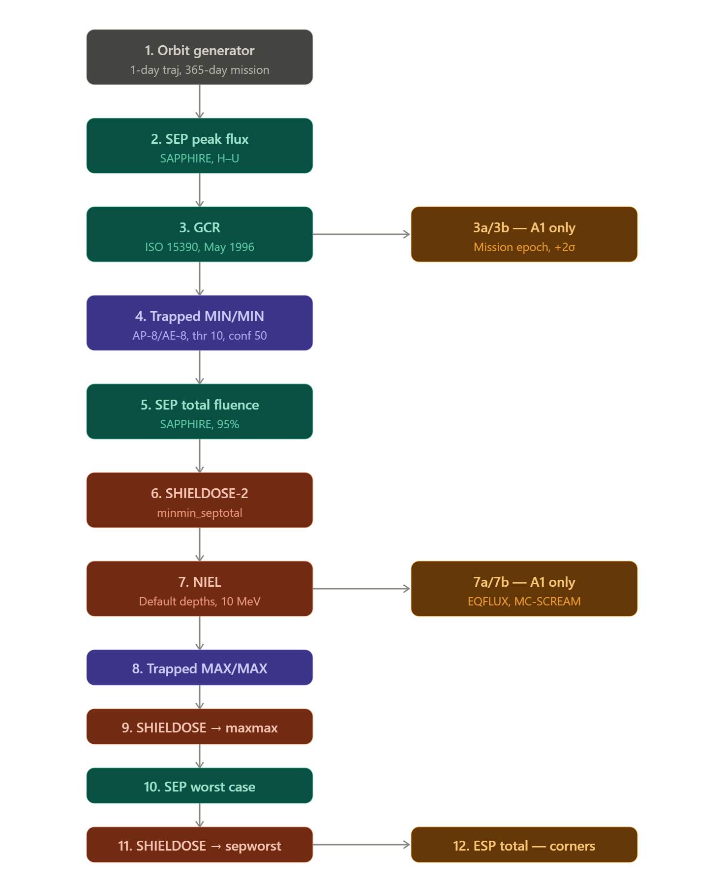

Settings used in web tool.

Orbit Generator
	
	Mission segments: 1
	Mission end: total mission duration
		365 days
	Account for solar radiation pressure: no
	Account for atmospheric drag: no

	Parameters for segment 1
		Case A:
			Orbit type: Heliosynchronous
			Orbit start: 1/1/26, 00:00:00
			trajectory duration: 1 day
			Altitude: 500 km, etc.
			Local time of ascending node: 6 hr
		Case B:
			Orbit type: General
			Orbit start: 1/1/26, 00:00:00
			trajectory duration: 1 day
			Altitude specification: Altitude for a circular orbit
			Altitude: 500 km, etc.
			Inclination: 30 deg
			RAAN: 0
			Argument of perigee: 0
			True anomaly: 0

Radiation sources and effects

	Trapped radiation models
		Proton Model: AP-8
			Model version: [solar max, solar min]
			Threshold flux for exposure (/cm^2/s): 10
		Electron Model: AE-8
			Model version: [solar max, solar min]
			Threshold flux for exposure (/cm^2/s): 10

	Solar Particle Mission Fluences
		Solar particle Model: [ESP-PSYCHIC (total fluence), (worst case), SAPPHIRE (total fluence), (worst case)]
		Ion range: H to H
		Confidence level: 95 %
		Magnetic Shielding: on
			Arrival Direction: all directions
			Magnetosphere: stormy
			Method: Stormer with eccentric dipole
			Magnetic field moment: CREME96

		Solar Particle Peak Fluxes
			Model: SAPPHIRE peak flux
			Ion range: H to U
			Prediction period: auto
			Offset in solar cylce: auto
			Confidence level: 95 %
			Magnetic Shielding: Same as above

		Galactic Cosmic Ray Fluxes
			Ion range: H to U
			GCR model at 1 AU: ISO 15390
				[ISO-15390 standard model, +2 sigma (at 500km only)]
			Solar activity data: [Solar Minimum (May 1996), mission epoch(at 500)]
			Magnetic Shielding: Same as above

		Ionizing dose for simple geometries (SHIELDOSE)
			Shielding depths: default values
			Dose model: SHIELDOSE-2
			Shielding configuration: centre of AI spheres
			Target material: Silicon

		NIEL (Non-ionizing energy loss)
			Shielding Depths: Default
			Damage factor [g/MeV]: 1.0E-11

		MC-SCREAM
			Cell type: Spectrolab UTJ
			Cover glass thickness: 100 um
		
		EQFLUX
			Cell type: Spectrolab UTJ
			Cover glass thickness: 100 um

Using Helio-synchronous
Cases A: [500, 700, 1000, 1200, 1500, 2000] km

Using General Circular orbit
Cases B: [500, 700, 1000, 1200, 1500, 2000] km

Workflow

12. run using ESP-PSYCHIC at A1, A6, B1, B6
