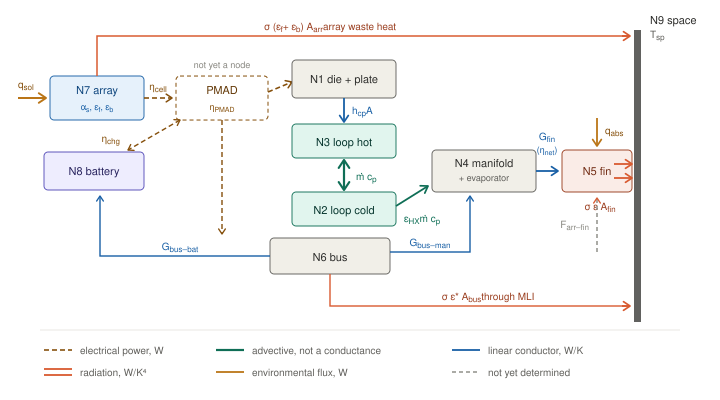

# Lumped-Parameter Node Network

**Status:** Thermal aside, Part C Layer 2 — deliverable T2
**Scope:** 30° shell, 800 km, 40 kW reference payload
**Code:** [`nodes.py`](../THERMPY/nodes.py)

---

> ## ⚠ Work in progress
>
> This document defines the network **topology** — nodes, conductors, capacitances,
> and the governing equations. That part is stable and does not depend on the
> unresolved inputs below.
>
> **The temperatures it produces are indicative, not predictive.** Four inputs are
> placeholders or pending corrections:
>
> | | Status |
> |---|---|
> | Cold-plate conductance $h_{cp}A$ | **Placeholder.** Needs the spreading-resistance sub-model, which does not exist. |
> | Loop–manifold conductance $UA_{\text{rad}}$ | **Placeholder.** |
> | Several capacitances | Order-of-magnitude estimates, not mass-budgeted. |
> | Radiator area, $q_{\text{abs}}$ | Inherits the pending Part A rerun (fin efficiency, face counting). |
> | Array–fin view factor | Zero until vehicle geometry is defined; could be worth up to +161% of panel load. |
>
> Node temperatures, margins and heater power should not be quoted from this
> document until those are resolved. The topology, the conductor forms, and the
> two structural findings in §5 do not depend on them.

---

## 1. Governing equations

Each diffusion node carries a capacitance $C_i = m_i c_{p,i}$ and exchanges heat with
its neighbours:

$$C_i \frac{dT_i}{dt} = \dot{Q}_i(t) + \sum_j G_{ij}\left(T_j - T_i\right) + \sum_j R_{ij}\left(T_j^4 - T_i^4\right)$$

Following SINDA convention, $\sigma$ is absorbed into the radiation conductor
$R_{ij} = \sigma \varepsilon_i A_i F_{ij}$, so linear conductors carry W/K and radiation
conductors W/K⁴.

The source term separates constant internal dissipation from the time-varying
environment:

$$\dot{Q}_i(t) = \dot{q}_{\text{int},i} + \alpha_{s,i} A_i \left[q_{\text{sol}}\cos\theta_i(t) + a\, q_{\text{sol}} F_i(t) K(t)\right] + \varepsilon_i A_i q_{\text{IR}} F_i(t)$$

with $\cos\theta_i$ clamped at zero and both solar terms vanishing in eclipse. Setting
$dT_i/dt = 0$ and summing over $i$ recovers the Layer 1 energy balance, which is the
network's only independent wiring check (§6).

---

## 2. Nodes

*Arranged as the energy flow. Sunlight enters the array at far left, is converted to
electrical power at $\eta_{\text{cell}}$, distributed through power management at
$\eta_{\text{PMAD}}$ to the payload, bus and battery, and then follows the thermal chain
rightward — cold plate, pumped loop, manifold, fin — to the space boundary on the right.
The array and bus reject their own waste heat by separate routed paths to the same
boundary. Every efficiency in the chain is labeled where the conversion happens.*

*PMAD is drawn dashed because it is **not yet a node**: `sizing.py` applies
$\eta_{\text{PMAD}}$ when sizing the array but never adds the conversion loss back as
heat (open item 5). Line style encodes transport type — dashed gold for electrical power,
solid blue for linear conduction, heavy teal for advective transport (not a conductance,
§3.1), doubled coral for radiation, amber for environmental flux. Symbols only; values are
in §3.*

Eight diffusion nodes, two boundary.

| # | Node | Contents | $C$ (J/K) | Notes |
|---|---|---|---:|---|
| N1 | die + plate | GPU die, package, cold plate | 1.8 × 10⁴ | Lumped; Biot number justifies |
| N2 | loop cold | Coolant, radiator outlet → cold plate inlet | 1.2 × 10⁴ | |
| N3 | loop hot | Coolant, cold plate outlet → radiator inlet | 1.2 × 10⁴ | Junction margin lives here |
| N4 | manifold + evap | Loop manifold and heat-pipe evaporator | 6.0 × 10³ | Where a survival heater acts |
| N5 | radiator fin | Panel, treated isothermal (§5) | 2.76 × 10⁵ | 67 m² × 4.58 kg/m² × 900 |
| N6 | bus | Structure, MLI-wrapped electronics | 9.0 × 10⁴ | |
| N7 | array | Solar array | 4.0 × 10⁴ | Radiatively coupled only |
| N8 | battery | Li-ion pack | 5.0 × 10⁴ | **Narrowest allowable: 0–40 °C** |
| N9 | space | Boundary, 3 K | ∞ | |
| N10 | Earth | Boundary, via $F$ and $q_{\text{IR}}$ | ∞ | |

**N4 is deliberately lumped.** The loop manifold and the heat-pipe evaporator are
physically distinct with a real interface between them, but splitting them buys nothing
until a heat-pipe transport model exists. The pipe appears nowhere as a conductor — it is
the Dirichlet boundary of the fin sub-model, so from the network's view the pipe *is* N4.

---

## 3. Conductors

| Link | Physics | Form | Value |
|---|---|---|---|
| N1–N3 | Cold plate, die to fluid | $h_{cp}A$ | 2.0 × 10³ W/K **placeholder** |
| N2 ↔ N3 | Pumped ammonia loop | $\dot{m}c_p$, advective | 4,230 W/K |
| N3 → N4 | Loop to manifold | effectiveness-NTU | $\varepsilon_{\text{HX}} = 0.849$ |
| N4–N5 | Heat pipe + fin | $G$, with $\eta_{\text{net}}$ folded in | 1.0 × 10⁴ W/K |
| N6–N8 | Bus to battery | $kA/L$ | 15 W/K |
| N6–N4 | Bus to manifold | $kA/L$ | 5 W/K |
| N5–N9 | Fin to space | $\sigma\varepsilon A$ | $A$ = 134 m² radiating |
| N7–N9 | Array to space | $\sigma\varepsilon A$ | $A$ = 2 × 232 m², **both faces** |
| N6–N9 | Bus through MLI | $\sigma\varepsilon^* A$ | $\varepsilon^* = 0.02$ |
| N7–N5 | Array to fin | $\sigma\varepsilon A F$ | $F = 0$ pending geometry |

### 3.1 The loop is advective, not conductive

Heat moves with the fluid, not down the gradient. For a closed two-node loop the
exchange happens to take a symmetric form —

$$\dot{Q}_3 = \dot{m}c_p\left(T_2 - T_3\right), \qquad \dot{Q}_2 = \dot{m}c_p\left(T_3 - T_2\right)$$

— but that symmetry is a coincidence of having exactly two nodes in a closed circuit. It
breaks with three or more, and the term should not be treated as a conductance.

At 42.4 kW across a 10 K design rise with ammonia ($c_p \approx 4{,}700$ J/kg·K),
$\dot{m} = 0.90$ kg/s and $\dot{m}c_p = 4{,}230$ W/K.

**Where the heat leaves matters.** The radiator exchange happens as fluid transits the hot
leg to the cold leg, so it acts on N2. Placing it on N3 forces $T_3 = T_2$ at steady state
and the loop rise vanishes entirely — a wiring error that still passes the energy balance
check, since total heat in still equals total heat out.

### 3.2 Effectiveness-NTU for the radiator exchange

A two-node loop cannot resolve the temperature profile along the manifold, so writing
$UA(T_{\text{outlet}} - T_4)$ understates the driving $\Delta T$ by the full loop rise.
The correct two-node form uses the **inlet** temperature with an effectiveness:

$$NTU = \frac{UA_{\text{rad}}}{\dot{m}c_p}, \qquad \varepsilon_{\text{HX}} = 1 - e^{-NTU}, \qquad \dot{Q}_{\text{HX}} = \varepsilon_{\text{HX}}\,\dot{m}c_p\left(T_3 - T_4\right)$$

At the placeholder $UA_{\text{rad}} = 8{,}000$ W/K this gives $NTU = 1.89$ and
$\varepsilon_{\text{HX}} = 0.849$. The form stays correct if $\dot{m}$ or $UA$ change later.

---

## 4. Stiffness and integration

| Element | Time constant |
|---|---:|
| Coolant loop, $C/\dot{m}c_p$ | 2.8 s |
| Radiator fin, radiative | 332 s |
| Fin internal gradient, 1st Fourier mode | 39 s |

A **117:1** spread before the die node is considered, so an explicit integrator is not an
option. `nodes.integrate` uses Radau; BDF also works. Lumping N1 into N3 to reduce
stiffness buys nothing — the loop-to-radiator ratio is already there — and it would
discard the junction temperature, which is the margin that matters.

---

## 5. Why the radiator is one node

Tested directly against a 41-node resolved fin over a 35-minute eclipse, payload off.

**Pump off — one node is exact, not approximate.** The fin's internal gradient decays on
the first Fourier mode, $\tau = CL^2/(\pi^2 k t_f) = 39$ s, against a radiative cooling
constant of 332 s. Within about a minute the panel is isothermal and stays so while it
cools.

| $t$ (min) | Root (°C) | Tip (°C) | Spread (K) | Lumped error (K) |
|---:|---:|---:|---:|---:|
| 0 | 44.9 | 19.2 | 25.6 | 0.0 |
| 1 | 19.9 | 16.2 | 3.8 | 0.0 |
| 5 | −9.7 | −9.7 | 0.0 | 0.0 |
| 35 | −75.4 | −75.4 | 0.0 | 0.0 |

The initial 25.6 K droop is a *forced* gradient — it exists only while heat flows from
root to tip. Remove the source and it collapses. This was not the expected result; the
plan's §11 anticipated needing 2–3 nodes across the span.

**Heater on — one node fails badly.** Pinning the root at 45 °C sustains a 29 K spread
indefinitely, and a single node overstates the panel mean by **19.8 K**. The network
therefore keeps N4 and N5 as separate nodes, with $\eta_{\text{net}}$ in the conductor
between them. That captures both regimes without resolving the span.

### Two findings that fall out of the same run

**The panel reaches −75.4 °C after a 35-minute eclipse with the pump off**, against an
ammonia freeze point of −77.7 °C. That is 2.3 K of margin, which is no margin. Working
fluid selection, loop draining, or panel isolation becomes a design requirement rather
than an option.

**Holding the root at 45 °C draws 678 W per m² of panel.** Across 67 m² that is 45 kW of
heater power — more than the payload it is protecting. You cannot heat your way through
this eclipse.

---

## 6. Layer 1 check

Setting $dT_i/dt = 0$ and summing recovers the whole-vehicle balance. This is the only
independent check that the conductor matrix is wired correctly — a sign error or a
misplaced exchange is otherwise invisible.

Hot case, 40 kW payload, 42.4 kW total dissipation:

| Node | Steady state |
|---|---:|
| die + plate | 68.5 °C |
| loop hot | 47.3 °C |
| loop cold | 37.3 °C |
| manifold + evap | 35.5 °C |
| radiator fin | 31.3 °C |
| bus | 20.5 °C |
| array | 32.7 °C |
| battery | 21.2 °C |

- Loop rise: **10.0 K** against a 10 K design value
- Radiator net rejection 42.3 kW against 42.4 kW dissipated — **balance closes to 0.18%**
- Array at 32.7 °C matches `environment.array_temperature()` computed independently
- Die margin to the 85 °C junction limit: **16.5 K**

Three independent agreements. The residual 0.18% is integration tolerance.

**Do not read these as predictions.** The die temperature in particular is a direct
function of the placeholder $h_{cp}A$, and the 16.5 K margin would move substantially with
a real spreading-resistance model.

---

## 7. Open items

1. **Spreading-resistance sub-model** for $h_{cp}A$ (N1–N3). Sets the die temperature and
   therefore the only margin against a hard limit.
2. **$UA_{\text{rad}}$** from manifold geometry.
3. **Capacitance budget.** Several values are order-of-magnitude. They do not affect
   steady state but set every transient time constant.
4. **Part A rerun** — radiator area and $q_{\text{abs}}$ inherit the fin-efficiency and
   face-counting corrections. **Fold the PMAD losses of item 5 into the same pass**, since
   both change the radiator area and both propagate into `sizing.py`, $A/m$, and the
   altitude trade.
5. **PMAD losses are missing from the heat budget.** `sizing.py` divides by
   $\eta_{\text{PMAD}} = 0.90$ when sizing the array but never adds the 10% back as heat.
   Conversion loss dissipates in the PMAD units; it does not leave the vehicle. True total
   dissipation at 40 kW payload is **47.1 kW, not 42.4** — a further 11% on radiator area,
   compounding with the 33% from fin efficiency to roughly +48% overall.
6. **Heat is injected at the wrong nodes.** All dissipation currently lands on N1. Pump
   work belongs in the fluid (N2/N3) and optical terminals plus avionics on the bus (N6);
   only the 40 kW rack belongs on N1. Steady state barely moves — the heat leaves through
   the same radiator — but the transient does, since bus loads are currently routed through
   cold-plate and loop capacitances they never touch.
7. **Battery capacitance is ~5× too small and self-heating is absent.** At 248 kg the pack
   is 248 kJ/K, not the 50 kJ/K assumed, and discharge losses at ~95% efficiency put
   **2.1 kW into it through eclipse — a +18.9 K rise**. N8 is therefore *not* the survival
   heater driver; it is the one component with a guaranteed internal source exactly when
   everything else is cooling. The real risk is the 40 °C upper limit in the hot case.
8. **Array cell efficiency is fixed** at 0.28; it should solve with temperature at
   −0.4%/K, as §7.3 of the work plan specifies.
9. **Array–fin view factor** once vehicle geometry is defined.
10. **Heat-pipe transport limit** as a post-processing assertion on N4–N5, since a fixed
   conductance models neither the near-isothermal regime nor dryout.
11. **Part B case definitions** — hot, cold and nominal — before any margin is quoted.
12. **Coolant selection** in light of the −75.4 °C result.
