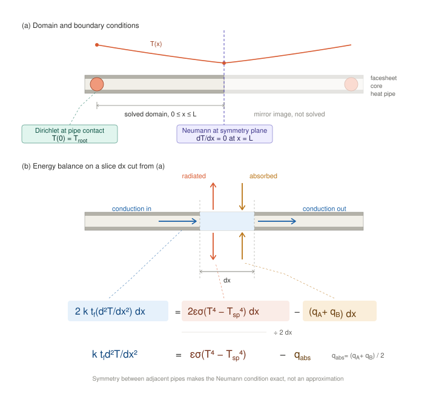

# Radiator Fin Conduction Sub-Model

**Status:** Thermal aside, Part C Layer 3 — deliverable T3
**Scope:** 30° shell, 800 km, zenith/deployed radiator panels
**Code:** [`run_radiator_fin_submodel.py`](../THERMPY/run_radiator_fin_submodel.py) — regenerates every table below, using [`conduction.py`](../THERMPY/conduction.py) and [`environment.py`](../THERMPY/environment.py)

---

> **This sub-model requires one iteration once the panel and bus geometry are defined.**
> Every absorbed-flux figure below treats each radiating surface as an isolated flat
> plate seeing space and Earth only. No inter-surface view factors are included: no
> array-to-radiator radiative coupling, no bus blockage of the radiator's view to space,
> no panel-to-panel exchange. The array coupling alone is worth between 0% and +161% of
> the radiator's entire environmental load depending on boom layout (§7), which is larger
> than any other correction in this document. **The fin formulation and the fin
> optimization are unaffected — only the value of $q_{\text{abs}}$ fed into them changes.**
> Re-run this sub-model when the configuration is fixed.

---

## 1. What this sub-model produces

Three things the rest of the study needs:

1. **Fin efficiency $\eta_{\text{net}}$** — the factor by which a real radiator underperforms
   an isothermal plate at root temperature. Part A implicitly assumed $\eta = 1$.
2. **Radiator areal mass $\mu_{\text{rad}}$** — derived from a fin geometry optimization,
   replacing the assumed `radiator_kg_per_m2 = 10.0` in `sizing.MassModel`.
3. **The conductor value** feeding node N4 in the Layer 2 network (Part C).

---

## 2. Governing equation

Energy balance on a differential slice of the sandwich panel, unit width, thickness $dx$
along the fin. Two facesheets of thickness $t_f$ carry all conduction; both outer surfaces
radiate and both absorb environmental flux.

$$\frac{d}{dx}\left(2 k t_f \frac{dT}{dx}\right) dx = \left[\varepsilon\sigma\left(T^4 - T_{sp}^4\right) - q_A\right] dx + \left[\varepsilon\sigma\left(T^4 - T_{sp}^4\right) - q_B\right] dx$$

where $q_A$ and $q_B$ are the absorbed environmental fluxes on the two faces. Dividing by 2:

$$k t_f \frac{d^2T}{dx^2} = \varepsilon\sigma\left(T^4 - T_{sp}^4\right) - q_{\text{abs}}, \qquad q_{\text{abs}} \equiv \frac{q_A + q_B}{2}$$

**The two faces enter only through their mean.** A panel with an illuminated face and a
shaded face behaves identically to one with both faces at the average — the facesheets are
isothermal through thickness (§5) so the two loads simply sum into one slice. This is why
the asymmetric edge-on configuration is treated with a single $q_{\text{abs}}$.

*(a) The fin spans from one embedded heat pipe to the next. The solved domain runs from the
pipe contact at $x = 0$ to the symmetry plane at $x = L$; everything beyond is the mirror
image. The Dirichlet condition fixes temperature at the pipe contact, the Neumann condition
sets zero gradient at the symmetry plane, and the sketched profile $T(x)$ shows why — the
minimum sits at the plane, so the gradient there vanishes by construction.
(b) A slice of width $dx$ cut from that domain, with each term of the balance mapped to the
flux it represents. Blue: conduction along the facesheets. Coral: radiation leaving both
outer surfaces. Amber: environmental flux absorbed on both. Dividing through by $2\,dx$
gives the working form.*

This is Fourier conduction with a nonlinear distributed sink. It is the classic fin
equation with $h(T - T_\infty)$ replaced by $\varepsilon\sigma(T^4 - T_{sp}^4)$, and that
replacement is what removes the closed-form solution.

### Boundary conditions

$$T(0) = T_{\text{root}}, \qquad \left.\frac{dT}{dx}\right|_{x=L} = 0$$

$L$ is the **half**-spacing between heat pipes, so $x = L$ is a symmetry plane midway
between two pipes. The adiabatic tip is therefore exact, not an approximation — conditions
are mirror-identical either side, so no heat can cross. The domain is one half-span,
solved once and tiled across the panel.

The root condition assumes the heat pipe is isothermal along its length. See §8.

### Fin efficiency

Defined conventionally — net heat actually removed, over net removed by an isothermal fin
at root temperature:

$$\eta_{\text{net}} = \frac{\int_0^L \left[\varepsilon\sigma\left(T^4 - T_{sp}^4\right) - q_{\text{abs}}\right] dx}{\left[\varepsilon\sigma\left(T_{\text{root}}^4 - T_{sp}^4\right) - q_{\text{abs}}\right] L}$$

Note the denominator carries $q_{\text{abs}}$ too. This matters — see §4.

---

## 3. Solution methods and validation

### 3.1 Linearized

Writing $\varepsilon\sigma(T^4 - T_{sp}^4) \approx h_{\text{rad}}(T - T_{sp})$ with
$h_{\text{rad}} = 4\varepsilon\sigma\bar{T}^3$ recovers the standard fin solution:

$$\eta_{\text{lin}} = \frac{\tanh(mL)}{mL}, \qquad m = \sqrt{\frac{h_{\text{rad}}}{k t_f}}$$

$m$ is the **fin parameter**, with units of m$^{-1}$: $h_{\text{rad}}$ is W m$^{-2}$ K$^{-1}$
and $k t_f$ is W K$^{-1}$, so their ratio is m$^{-2}$. Its reciprocal $1/m$ is the
**conduction length** — the distance heat travels through the facesheets before radiation
drains it. The product $mL$ is therefore **dimensionless**: the fin half-length measured in
conduction lengths. It is the single parameter governing fin behavior, and every result in
§4 and §9 collapses onto it. For the Al 6061 optimum, $1/m = 82$ mm and $L = 88$ mm, so
$mL = 1.07$.

### 3.2 Nonlinear

Solved as a two-point **boundary value problem** (BVP) — an ODE with conditions imposed at
both ends of the domain (here $T$ at the root and $dT/dx$ at the tip) rather than both at
one end, so it cannot be marched forward and must be solved across the whole domain at once.
Collocation is used (`scipy.integrate.solve_bvp`). A uniform initial guess
at $T_{\text{root}}$ exceeds the mesh node limit without converging, because it places the
whole domain far from the solution and the solver refines the mesh rather than moving the
profile. The linearized solution of §3.1,
$T(x) = T_{eq} + (T_{\text{root}} - T_{eq})\cosh\!\left[m(L-x)\right]/\cosh(mL)$,
is used as the starting iterate instead. This is a change of *initial guess*, not of method
— §3.3 below is a separate solver written independently to check this one.

### 3.3 Finite-difference cross-check

Run at the module default $t_f = 0.30$ mm (the validation compares two solvers, so the
geometry is immaterial to the claim; §4 onward uses 0.25 mm). An independent second solver,
so that a wrong answer from collocation would not go unnoticed: the same BVP discretized with second-order central differences and solved by
Newton's method with an analytic Jacobian. Newton is used here because the first attempt at
this check — Jacobi iteration — failed (see the note below), not because of anything in
§3.2. Agreement with the collocation result:

| $L$ (mm) | $\eta_{\text{bvp}}$ | $\eta_{\text{fd}}$ | Difference | Tip (°C) |
|---:|---:|---:|---:|---:|
| 50 | 0.910870 | 0.911010 | −0.015% | 36.1 |
| 75 | 0.827455 | 0.827681 | −0.027% | 27.4 |
| 100 | 0.741686 | 0.741961 | −0.037% | 18.0 |
| 150 | 0.592490 | 0.592776 | −0.048% | 0.0 |
| 200 | 0.480982 | 0.481226 | −0.051% | −14.8 |

Grid convergence at $L = 100$ mm is monotonic toward the collocation value — 0.743944 at
$n = 51$, 0.741823 at $n = 801$, against 0.741686 from `solve_bvp` — the expected
first-order behavior, confirming both methods solve the same problem.

*Note: the first version of this cross-check used Jacobi iteration and produced nonsense —
profiles that barely cooled below root temperature, disagreeing with §3.2 by up to 50%.
Jacobi convergence scales as $n^2$; at $n = 4001$ it needs roughly 16 million sweeps and was
given 200,000, so it returned an unconverged profile that looked like a physical result. The
Newton solve above is the valid comparison. Recorded because an unconverged iterative solve
fails silently — it returns numbers, not an error.*

---

## 4. When the linearization fails

All rows at $t_f = 0.25$ mm and $q_{\text{abs}} = 98$ W/m², so $mL$ is the only variable.

| $L$ (mm) | $mL$ | $\eta_{\text{lin}}$ | $\eta_{\text{nl}}$ | Error | Tip (°C) |
|---:|---:|---:|---:|---:|---:|
| 20 | 0.244 | 0.9807 | 0.9808 | −0.01% | 43.0 |
| 40 | 0.487 | 0.9277 | 0.9294 | −0.18% | 37.9 |
| 60 | 0.731 | 0.8531 | 0.8594 | −0.73% | 30.8 |
| **88** | **1.072** | **0.7370** | **0.7538** | **−2.22%** | **19.3** |
| 120 | 1.462 | 0.6142 | 0.6434 | −4.54% | 6.4 |
| 180 | 2.193 | 0.4447 | 0.4864 | −8.57% | −14.0 |
| 250 | 3.046 | 0.3268 | 0.3687 | −11.37% | −30.7 |
| 350 | 4.265 | 0.2344 | 0.2692 | −12.95% | −45.0 |

Bold row is the mass optimum of §9.

The error is **always negative** — linearising always under-predicts efficiency — and it
tracks $mL$ cleanly. The reason it is conservative rather than random: $h_{\text{rad}}$ is
evaluated at $\bar{T} = T_{\text{root}}$, over-estimating radiative loss everywhere
downstream where the fin is colder.

**Working rule: linearize for $mL < 1$ (error under 3%); solve the BVP beyond it.**

### $mL$ is the only group, and the collapse is exact

Non-dimensionalizing with $\xi = x/L$ and $\theta = T/T_{\text{root}}$:

$$\frac{d^2\theta}{d\xi^2} = \frac{(mL)^2}{4}\left[\theta^4 - \left(\frac{T_{sp}}{T_{\text{root}}}\right)^4 - \frac{q_{\text{abs}}}{\varepsilon\sigma T_{\text{root}}^4}\right]$$

The solution depends on $mL$ and on $q_{\text{abs}}/(\varepsilon\sigma T_{\text{root}}^4)$,
and on nothing else. The second group is 0.1988 throughout this study, so $mL$ alone fixes
the answer. Reaching the same $mL$ by different routes — $L$ scaling as $\sqrt{t_f}$ —
must therefore give identical results:

| Target $mL$ | $t_f$ (mm) | $L$ (mm) | $\eta_{\text{lin}}$ | $\eta_{\text{nl}}$ | Error | Tip (°C) |
|---:|---:|---:|---:|---:|---:|---:|
| 0.60 | 0.20 | 44.0 | 0.8951 | 0.8985 | −0.38% | 34.8 |
| 0.60 | 0.30 | 53.9 | 0.8951 | 0.8985 | −0.38% | 34.8 |
| 0.60 | 0.50 | 69.6 | 0.8951 | 0.8985 | −0.38% | 34.8 |
| 0.60 | 1.00 | 98.5 | 0.8951 | 0.8985 | −0.38% | 34.8 |
| 1.07 | 0.20 | 78.5 | 0.7378 | 0.7545 | −2.21% | 19.4 |
| 1.07 | 0.30 | 96.2 | 0.7378 | 0.7545 | −2.21% | 19.4 |
| 1.07 | 0.50 | 124.2 | 0.7378 | 0.7545 | −2.21% | 19.4 |
| 1.07 | 1.00 | 175.6 | 0.7378 | 0.7545 | −2.21% | 19.4 |
| 2.00 | 0.20 | 146.8 | 0.4820 | 0.5219 | −7.64% | −9.2 |
| 2.00 | 0.30 | 179.8 | 0.4820 | 0.5219 | −7.64% | −9.2 |
| 2.00 | 0.50 | 232.1 | 0.4820 | 0.5219 | −7.64% | −9.2 |
| 2.00 | 1.00 | 328.2 | 0.4820 | 0.5219 | −7.64% | −9.2 |

Identical to four decimals at each $mL$, across a 5× range of facesheet thickness and a
4× range of fin length. **The $mL < 1$ rule is a statement about the governing equation,
not an empirical fit to one geometry** — it transfers to any panel at this
$T_{\text{root}}$ and $q_{\text{abs}}$.

### The linearization cannot see $q_{\text{abs}}$, and does not need to

$\eta_{\text{lin}}$ is unchanged by the absorbed flux. Linearising *with* a source gives

$$k t_f \frac{d^2T}{dx^2} = h_{\text{rad}}\left(T - T_{eq}\right)$$

with $T_{eq}$ the radiative equilibrium — the same $\cosh$ solution, merely about a
different asymptote. Because net efficiency is measured relative to that asymptote,
$\tanh(mL)/(mL)$ comes out identical. Verified numerically: integrating the linearized
profile with the source reproduces the closed form to six digits at every $L$. Only the
nonlinear column responds to $q_{\text{abs}}$.

### The source term does not help efficiency

Adding $q_{\text{abs}}$ makes the fin substantially warmer — tip rises from 12.7 °C to
19.3 °C at the optimum, and by 41 K at $L = 350$ mm — yet $\eta_{\text{net}}$ gets slightly
**worse**:

| $L$ (mm) | $mL$ | $\eta$, $q = 0$ | Tip (°C) | $\eta_{\text{net}}$, $q = 98$ | Tip (°C) | Change |
|---:|---:|---:|---:|---:|---:|---:|
| 20 | 0.244 | 0.9808 | 42.5 | 0.9808 | 43.0 | −0.0% |
| 40 | 0.487 | 0.9298 | 36.2 | 0.9294 | 37.9 | −0.0% |
| 60 | 0.731 | 0.8609 | 27.3 | 0.8594 | 30.8 | −0.2% |
| **88** | **1.072** | **0.7580** | **12.7** | **0.7538** | **19.3** | **−0.6%** |
| 120 | 1.462 | 0.6512 | −4.1 | 0.6434 | 6.4 | −1.2% |
| 180 | 2.193 | 0.4997 | −32.3 | 0.4864 | −14.0 | −2.7% |
| 250 | 3.046 | 0.3850 | −58.4 | 0.3687 | −30.7 | −4.2% |
| 350 | 4.265 | 0.2860 | −86.2 | 0.2692 | −45.0 | −5.9% |

The tip is the clearer signal: at $L = 350$ mm the source holds the fin **41 K warmer**,
because it cannot fall below the equilibrium temperature. Efficiency still drops.

Efficiency is a ratio, and the source shrinks the denominator faster than it helps the
numerator. The reference quantity becomes
$\varepsilon\sigma T_{\text{root}}^4 - q_{\text{abs}} = 493 - 98 = 395$ W/m² instead of
the full 493, so the same absolute droop is a larger *fractional* loss.

### What the source term does reveal

A hard ceiling on useful fin length that does not exist without it. With
$q_{\text{abs}} = 98$ W/m², radiative equilibrium sits at **−60.8 °C** — a fin approaching
that temperature removes *zero* net heat, so beyond some length the panel is mass that does
nothing. Without the source the fin contributes however long it grows, merely with
diminishing returns. This ceiling is what actually bounds fin length on a sunlit radiator.

---

## 5. Assumptions

| Assumption | Justification | Confidence |
|---|---|---|
| 1-D through thickness | $\text{Bi} = h_{\text{rad}} t_f / k = 9\times10^{-6}$ | Safe by 5 orders of magnitude |
| 1-D along the pipe | 66:1 fin aspect ratio; 2-D solve gives +0.30% (§6) | Strong |
| Core carries no heat | Honeycomb in-plane conductivity negligible vs facesheets | Conservative |
| Isothermal root | Heat pipes near-isothermal by construction | See §8 |
| Steady state | Fin $\tau \approx 8$ min vs 109 min orbit | Holds for hot case; **fails for the cold-case transient** |
| Uniform $q_{\text{abs}}$ | No shadowing modeled | See §7 |
| Both faces at mean flux | Exact for the 1-D slice balance (§2) | Exact |
| Core 15 mm at 50 kg/m³ | Typical Al honeycomb; **not sourced** | Assumption |
| Heat pipes 0.35 kg/m | Axially grooved Al/ammonia; **not sourced** | Assumption — §9 |
| Misc 0.5 kg/m² | Coating, adhesive, doublers; **not sourced** | Assumption |
| Facesheet floor 0.25 mm | Handling and manufacturability, not physics | Constraint boundary |

The last four set 71% of the panel areal mass (§9). The heat-pipe rate also moves the
geometric optimum, not just the total — see the sensitivity there.

---

## 6. Dimensionality: 1-D is sufficient

Heat pipes run the full panel length, so each fin is 88 mm across and ~5.8 m long — a
**66:1 aspect ratio**. There is no gradient to resolve along the pipe: it is isothermal by
construction, the environment is uniform along it, and the far edges are adiabatic. Only
the strip within one conduction length (82 mm) of a pipe *end* is genuinely 2-D, which is
**2.8% of panel area**.

A 2-D finite-difference solve of a panel strip against the 1-D result:

| Span $L_y$ | 2-D net (W/m²) | 1-D net (W/m²) | Difference |
|---:|---:|---:|---:|
| 88 mm | 298.6 | 297.7 | +0.300% |
| 250 mm | 298.6 | 297.7 | +0.300% |
| 1,000 mm | 298.6 | 297.7 | +0.300% |
| 2,900 mm | 298.6 | 297.7 | +0.300% |

The residual is constant across a 33× range of span — that is a discretization floor, not
an edge effect. **2-D buys nothing here.**

Boundary conditions on the 2-D patch: Dirichlet at the heat pipe edge, adiabatic on the
other three — two by symmetry between adjacent pipes, one at the pipe end.

Where 2-D *would* matter, in descending order of magnitude:

1. **Partial shadowing** by the bus or opposite panel. Shadow boundaries do not align with
   the fin direction. The fix is a 2-D flux map feeding a set of 1-D fins with local
   $q_{\text{abs}}$, not a 2-D fin.
2. **Heat pipe axial gradient** (§8) — ~15× larger than the geometric 2-D effect.
3. **Manifold and header regions** — genuinely 2-D, small area, properly a
   spreading-resistance problem.

---

## 7. Inter-surface view factors — the missing term

Fins within a panel are **coplanar**, so their mutual view factor is exactly zero. Same for
two deployed panels lying in the same plane. Nothing is missing there.

Panel configurations are compared per m² of **physical panel**, counting radiating faces
explicitly — Part A originally compared per radiating area and then applied a blanket
factor of two, which credits a body-mounted panel with a second face it does not have:

| Configuration | Faces | Per-face $q$ (W/m²) | Mean (W/m²) | Net (W/m² panel) |
|---|---:|---|---:|---:|
| **deployed-edge-on** | 2 | 147, 49 | **98** | **790** |
| deployed-horizontal | 2 | 122, 215 | 169 | 649 |
| body-zenith | 1 | 122 | 122 | 370 |
| body-nadir | 1 | 215 | 215 | 278 |

Edge-on wins because it minimizes Earth view factor on *both* faces and splits the solar
load across two radiating surfaces. Solar is intermittent and splittable; Earth IR is
permanent and scales directly with view factor.

What is missing is coupling between different structures. A solar array's back face runs at
~33 °C and emits 422 W/m². Its coupling to a radiator depends entirely on boom layout, and
the cost of the pending iteration is bounded here before it is run:

| Separation | $F_{\text{array}}$ | $q_{\text{abs}}$ (W/m²) | $\eta_{\text{net}}$ | W/m² panel | kg/kW | Mass penalty |
|---|---:|---:|---:|---:|---:|---:|
| coplanar | 0.000 | 98 | 0.753 | 595 | 7.71 | — |
| 20 m | 0.027 | 108 | 0.753 | 580 | 7.91 | +3% |
| 10 m | 0.093 | 131 | 0.752 | 543 | 8.44 | +9% |
| 6 m | 0.200 | 170 | 0.750 | 485 | 9.46 | +23% |
| 3 m | 0.415 | 247 | 0.747 | 367 | 12.48 | +62% |

$F$ is computed by `environment.view_factor_parallel` for two directly opposed 6 × 6 m
plates; the array back-face temperature comes from `environment.array_temperature`, an
energy balance on absorbed solar minus electrical output radiating from both faces:

$$\left[\alpha_s - \eta_{\text{cell}}(T)\right] q_{\text{sol}} = \left(\varepsilon_f + \varepsilon_b\right)\sigma T^4$$

giving 32.7 °C at $\alpha_s = 0.90$ and $\eta_{\text{cell}} = 0.28$, so 422 W/m² leaving the
back face. A lateral offset or a coplanar arrangement gives $F = 0$ exactly — that is the
whole design point.

Sun-tracking pushes toward the bad case: at high $\beta$ the array normal points along orbit
normal, and so do the radiator normals, so the two are parallel at exactly the $\beta$ where
the radiator is already working hardest. Parallel plates either face each other or sit
coplanar, and which one occurs is purely a matter of boom placement.

**Design rule falling out of this: keep the array coplanar with the radiators, laterally
offset, not stacked axially in front of them.** It costs nothing structurally and is worth
up to 77% of the radiator's environmental budget.

Bus blockage removes solid angle from the radiator's view of space — a loss, not a gain —
but the bus is small relative to 6 m panels and mostly occludes grazing directions that
contribute little. Not yet quantified.

---

## 8. Heat pipe assumption

$T_{\text{root}}$ is taken constant along the pipe. Real axially grooved heat pipes hold a
few kelvin end to end, and considerably more near their capillary or entrainment limits. A
3 K droop over 5.8 m changes local rejection by roughly 3.8% — **fifteen times the 2-D
geometric effect of §6**, and larger than every numerical error in this document.

No heat pipe transport model exists in this study. Capillary limit, entrainment limit,
sonic limit and boiling limit are all unchecked against the transported power. This is the
largest unmodeled effect inside the radiator itself, as distinct from §7 which is the
largest unmodeled effect outside it.

---

## 9. Panel model and mass optimization

Aluminium honeycomb sandwich: two facesheets, core, embedded heat pipes at spacing $2L$,
radiating from both faces.

$$\mu_{\text{rad}} = 2\rho t_f + \rho_{\text{core}} h_{\text{core}} + \frac{\mu_{\text{hp}}}{2L} + \mu_{\text{misc}}$$

Defaults: core 15 mm at 50 kg/m³, heat pipes 0.35 kg/m (axially grooved Al/ammonia),
misc 0.5 kg/m² (coating, adhesive, doublers).

Objective: minimize kg per kW rejected, where heat per m² of **physical** panel is

$$\dot{q}_{\text{panel}} = 2\,\eta_{\text{net}}\left[\varepsilon\sigma\left(T_{\text{root}}^4 - T_{sp}^4\right) - q_{\text{abs}}\right]$$

Optimized over $(t_f, L)$ at $T_{\text{root}} = 318$ K, $q_{\text{abs}} = 98$ W/m² (the
deployed edge-on configuration of §7):

| Material | $k$ (W/m·K) | $t_f$ (mm) | $L$ (mm) | $mL$ | $\eta_{\text{net}}$ | kg/m² | W/m² panel | kg/kW |
|---|---:|---:|---:|---:|---:|---:|---:|---:|
| Al 6061-T6 | 167 | 0.250 | 88.2 | 1.07 | 0.753 | 4.58 | 595 | 7.71 |
| Al 2024-T3 | 121 | 0.250 | 78.8 | 1.13 | 0.737 | 4.86 | 582 | 8.35 |
| Al 1100 | 222 | 0.250 | 97.0 | 1.02 | 0.768 | 4.41 | 607 | 7.27 |
| K1100 composite | 500 | 0.250 | 135.6 | 0.95 | 0.790 | **3.44** | 624 | **5.52** |

### Reading the optimum

**Facesheet thickness hits the 0.25 mm floor in every case.** Thinner is always lighter; the
binding constraint is handling and manufacturability, not physics. The optimum sits on a
constraint boundary, so sourcing thinner facesheets continues to reduce mass.

**The optimum sits at $mL \approx 1.07$**, and at $mL$ between 0.95 and 1.13 for every
material tested. For Al 6061, $k t_f = 0.042$ W/K and $h_{\text{rad}} = 6.20$ W/m²K, giving
a conduction length $1/m = 82$ mm against an optimal $L$ of 88.2 mm. The design statement: **make the fin about as long as its conduction length,
and no longer.** Shorter and you carry a heat pipe every few centimeters; longer and the tip
approaches the −60.8 °C equilibrium where it stops removing heat.

This is also, not coincidentally, exactly where the linearization starts to degrade (§4) —
both are set by the same conduction-versus-radiation balance.

**The optimum is shallow in $L$** (7.7 to 8.1 kg/kW across 80–125 mm) while $\eta$ varies
from 0.78 to 0.63 over the same span. There is real freedom to trade heat-pipe count
against fin performance at nearly constant mass.

**K1100 pitch-fibre composite wins by 28%** on mass, from higher in-plane conductivity at
lower density, and permits 54% wider pipe spacing — fewer heat pipes, fewer joints, fewer
leak paths. Not costed or qualified here.

### How much of 4.58 kg/m² is actually derived

Only the facesheet term. The other three come from coefficients that are assumed, never
varied, and not sourced:

| Term | kg/m² | Share | Status |
|---|---:|---:|---|
| Facesheets, $2\rho t_f$ | 1.35 | 29% | derived — $t_f$ optimized, floored at 0.25 mm |
| Core | 0.75 | 16% | **assumed** — 15 mm at 50 kg/m³ |
| Heat pipes, $\mu_{hp}/2L$ | 1.98 | 43% | **assumed rate** — $L$ optimized |
| Misc | 0.50 | 11% | **assumed** |
| **Total** | **4.58** | | **71% assumed** |

The heat-pipe rate is not merely additive — it sets the optimum. Heavier pipes push toward
longer fins and fewer of them, which costs fin efficiency:

| $\mu_{hp}$ (kg/m) | Optimal $L$ (mm) | $\eta_{\text{net}}$ | kg/m² | kg/kW |
|---:|---:|---:|---:|---:|
| 0.15 | 66.6 | 0.835 | 3.73 | 5.65 |
| 0.25 | 78.9 | 0.788 | 4.18 | 6.72 |
| **0.35** | **88.2** | **0.753** | **4.58** | **7.71** |
| 0.50 | 99.2 | 0.713 | 5.12 | 9.09 |
| 0.75 | 116.5 | 0.687 | 6.08 | 11.20 |

So $\eta_{\text{net}} = 0.753$, the 33% correction of §10, and $mL \approx 1.07$ all rest on
an unsourced 0.35 kg/m. Across the plausible range 0.15–0.75 kg/m, $\eta$ runs 0.84 to 0.69
and specific mass doubles. **This is the highest-leverage unsourced number in the
sub-model**, ahead of the non-panel mass of §10.

---

## 10. Impact on Part A

Part A used 395 W/m² net rejection at $T_{\text{rad}} = 318$ K with **no fin efficiency
applied** — an implicit $\eta = 1$. With $\eta_{\text{net}} = 0.753$ the figure is 297 W/m².

- **Radiator area understated by 33%.**
- Part A treated 45 °C as the *effective* radiating temperature. With a real fin, a 45 °C
  root gives an effective temperature of **23.1 °C**.
- Achieving 45 °C effective would need a **68.2 °C root**, pushing coolant outlet toward
  80 °C and breaking the 85 °C junction limit.

Working against this, the computed panel areal mass is **4.58 kg/m²** rather than the
assumed 10 — but two caveats apply, and together they mean the 10 kg/m² assumption is
**decomposed rather than replaced**.

First, scope: this sub-model covers panel plus heat pipes only. Deployment mechanism,
hinges, manifolds, pump, accumulator and fluid inventory are all excluded, so the remaining
5.42 kg/m² is a separate unsourced estimate.

Second, provenance: of the 4.58 kg/m², only the 1.35 kg/m² facesheet term is derived. The
other 71% comes from assumed coefficients (§9). Calling the result "derived" overstates it
— **29% derived, 71% assumed** is the honest description.

Net effect on vehicle mass is not obvious without re-running, and it feeds back into $A/m$,
drag, and the altitude selection. **Not yet propagated** — see the banner at the top; this
should be done in one pass together with the face-counting correction, not two.

---

## 11. Open items

1. **Re-run with real view factors** once panel and bus geometry are defined (§7). Largest
   single uncertainty.
2. **Source the heat-pipe mass rate** (§9). At 43% of panel areal mass and controlling the
   geometric optimum, this is the highest-leverage unsourced number in the sub-model.
   Sourcing the core and misc terms matters less but closes the remaining 27%.
3. **Heat pipe transport model** — axial gradient and operating limits (§8).
4. **Source thinner facesheets** — the optimum is on a manufacturing constraint, not a
   physical one (§9).
5. **Non-panel radiator mass** — deployment, manifolds, pump, fluid. ~5.4 kg/m² unsourced.
6. **Cold-case transient** — steady state fails when the payload is off in eclipse. The fin
   will need 2–3 nodes across its span in Layer 2, since a single lumped node would report a
   temperature that exists nowhere on the panel.
7. **K1100 cost and qualification** if the 25% mass saving is to be claimed.
