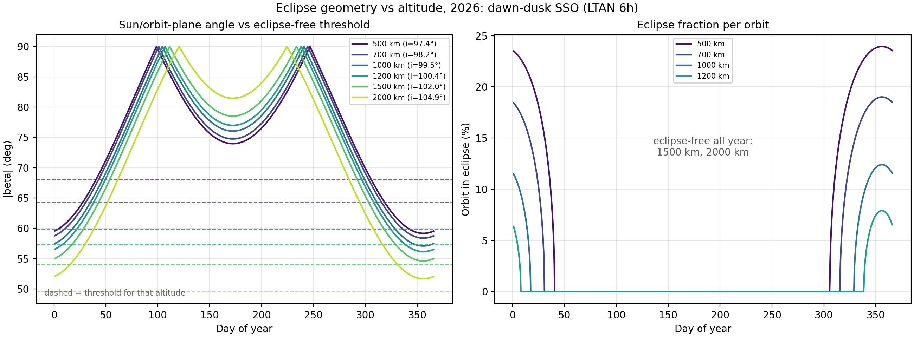
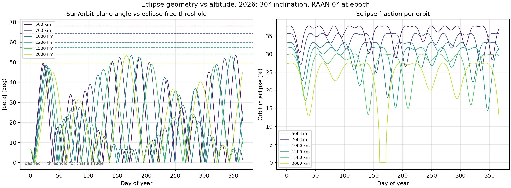

# Eclipse Geometry vs Altitude

**Status:** Phase 1 supporting analysis
**Figure:** [`figures/beta_eclipse_sweep_sso.png`](../figures/beta_eclipse_sweep_sso.png), [`figures/beta_eclipse_sweep_lowinc.png`](../figures/beta_eclipse_sweep_lowinc.png)
**Code:** [`plots.py`](../SPENVIS/SPENPY/plots.py)

---

## 1. Why this matters

The reference scenario proposes sun-synchronous shells for baseline compute on the
premise that they are **over 99% sunlit**, removing the need for large batteries and
allowing near-continuous operation of the compute payload. The filed altitude range
is 500–2,000 km, with a second family of shells at ~30° inclination for demand-peak
capacity.

That premise is altitude-dependent and orbit-dependent, and it does not hold across
the whole filed range. This note derives the condition, evaluates it over a full year
for both orbit families at six altitudes, and identifies where the premise breaks.

Two results:

- For **dawn–dusk sun-synchronous orbits** the premise fails below roughly 1,200 km.
  The reason is not simply "higher is better": sun-synchronicity ties inclination to
  altitude, and the inclination penalty cancels roughly 40% of the geometric benefit
  of climbing.
- For **30° orbits** the premise fails at every altitude in the filed range. Those
  shells are 64–76% sunlit and eclipse on essentially every revolution, year-round.

---

## 2. The orbits (Analytic Model)

### 2.1 Sun-synchronicity

A sun-synchronous orbit (SSO) exploits the Earth's oblateness. The J2 term of the
geopotential causes the right ascension of the ascending node, Ω, to precess at

$$\dot{\Omega} = -\frac{3}{2} J_2 \left(\frac{R_\oplus}{a}\right)^2 n \cos i$$

where `a` is semi-major axis, `n = sqrt(mu/a^3)` the mean motion, and `i` the
inclination. Choosing `i` such that this rate equals the mean rate of the Sun's
apparent motion along the ecliptic — 360° per 365.2422 days, or 1.99106 × 10⁻⁷ rad/s —
makes the orbit plane rotate with the Earth's motion about the Sun. The local solar time
at the ascending node (LTAN) is then approximately constant year-round. Physical constants: mu = 398600.4418 $\frac{km^3}{s^2}$, $R_{earth}$ = 6378.137 km, J2 = 1.08262668e-3.

Because `cos i` must be negative, every SSO is **retrograde**: `i > 90°`.

### 2.2 Inclination is a function of altitude

Solving the above for `i` at circular orbits gives:

| Altitude (km) | SSO inclination |
|---:|---:|
| 500 | 97.40° |
| 700 | 98.19° |
| 1,000 | 99.48° |
| 1,200 | 100.42° |
| 1,500 | 101.96° |
| 2,000 | 104.89° |

The 500 km value reproduces the 97.4° used in the SPENVIS orbit generator, confirming
the model. **Inclination rises with altitude**, and Section 5 shows this is what makes
the altitude trade non-obvious.

### 2.3 Dawn–dusk (LTAN 6h)

All A-cases use LTAN = 6h, placing the ascending node at the dawn terminator and the
descending node at dusk. The orbit plane is then close to perpendicular to the
Earth–Sun line, which:

- maximises the sun/orbit-plane angle, minimising or eliminating eclipse;
- keeps the solar array at a near-constant sun angle, avoiding a steering mechanism;
- puts one face of the spacecraft permanently anti-sunward, which is favourable for
  radiator placement — relevant given that thermal rejection, not power, is expected to
  be the binding constraint on orbital compute.

This is the standard configuration for power-limited missions and is what makes the
">99% sunlit" claim plausible in the first place. The question is at what altitude it
becomes true.

> **Assumption.** LTAN 6h is an analyst choice. It is the only local time that makes
> the sunlit premise achievable at any altitude in the filed range, but unless the
> filing specifies an LTAN this should be read as an assumption rather than a stated
> parameter.

### 2.4 Low inclination (B-cases)

The B-cases are circular at **30° inclination, RAAN 0° at epoch** — a general orbit with
no sun-synchronicity condition imposed. Their nodes therefore regress freely, at the rate
given by the same J2 expression with `cos i > 0`:

| Altitude | Nodal regression | Full nodal cycle |
|---:|---:|---:|
| 500 km | −6.63°/day | 47 days |
| 700 km | −5.99°/day | 52 days |
| 1,000 km | −5.18°/day | 58 days |
| 1,200 km | −4.72°/day | 63 days |
| 1,500 km | −4.12°/day | 71 days |
| 2,000 km | −3.32°/day | 84 days |

The Sun advances about 1°/day in right ascension, so the *relative* geometry Ω − α cycles
through 360° every 47 to 84 days. **The B-cases have no fixed sun angle**, and their
eclipse behaviour follows the nodal cycle rather than the seasons.

---

## 3. The beta angle

Define **β** as the angle between the Sun direction and the orbit plane. β = 90° places
the Sun normal to the orbit plane (deepest sunlight); β = 0° places the Sun in the orbit
plane, so the satellite passes directly behind the Earth every revolution.

$$\sin\beta = \cos\delta_\odot \sin i \sin(\Omega - \alpha_\odot) + \sin\delta_\odot \cos i$$

with `delta_sun` the solar declination and `alpha_sun` the solar right ascension.

For an SSO with frozen LTAN, the node stays at a fixed angle from the Sun:

$$\Omega - \alpha_\odot = (\mathrm{LTAN} - 12)\times 15°$$

For LTAN = 6h this is −90°, and the expression collapses to

$$\beta = -\arcsin\left[\sin(i - \delta_\odot)\right]$$

so β depends only on inclination and solar declination. Since `delta_sun` sweeps
±23.44° over the year, **β sweeps by roughly ±23° about a mean set by inclination.**

### 3.1 Annual behaviour, A-cases

|β| reaches 90° twice a year, when `delta_sun = i - 90°`. Between those peaks lies a
shallow June-solstice minimum; at either end of the year lies the **global minimum at
the December solstice**. Eclipse risk is therefore a winter phenomenon, concentrated in
a single season rather than distributed through the year.

### 3.2 B-cases and the general ceiling

For the B-cases the frozen-LTAN simplification does not apply. Ω is propagated from the
nodal regression rate of Section 2.4 and the full expression is evaluated directly, so β
oscillates on the nodal period rather than the solar year.

Maximising the full expression over both Ω and `delta_sun` gives a hard ceiling that
holds for any inclination and any RAAN:

$$\beta_{\max} = i + \epsilon$$

where `epsilon` = 23.44° is the obliquity. For a 30° orbit this is **53.44°** — a limit
no choice of epoch, node, or season can exceed. Section 6 shows it is the binding
constraint on the B-cases.

---

## 4. The eclipse condition

Using a cylindrical umbra of radius `R_earth`, a circular orbit avoids the shadow entirely when

$$|\beta| > \beta_{\mathrm{crit}} = \arcsin\!\left(\frac{R_\oplus}{R_\oplus + h}\right)$$

When `|beta| < beta_crit`, the fraction of each revolution spent in shadow is

$$f = \frac{1}{\pi}\arccos\!\left[\frac{\sqrt{h^2 + 2R_\oplus h}}{(R_\oplus + h)\cos\beta}\right]$$

`beta_crit` falls monotonically with altitude — the Earth subtends a smaller angle from
higher up — which is the intuitive reason altitude helps:

| Altitude | 500 | 700 | 1,000 | 1,200 | 1,500 | 2,000 km |
|---|---:|---:|---:|---:|---:|---:|
| β_crit | 68.02° | 64.30° | 59.82° | 57.31° | 54.06° | 49.58° |

---

## 5. A-cases: the competing trends

Two altitude dependencies act in opposition:

| | 500 km | 2,000 km | Change |
|---|---:|---:|---:|
| `beta_crit` (threshold to clear) | 68.02° | 49.58° | **−18.44°** |
| `beta_min` (annual minimum, Dec solstice) | 59.16° | 51.67° | **−7.49°** |
| Margin (`beta_min − beta_crit`) | −8.86° | +2.10° | +10.96° |

Climbing lowers the threshold by 18.44°, but the accompanying inclination increase
(97.40° → 104.89°) tilts the orbit plane further from the Sun and drops `beta_min` by
7.49°. **Altitude wins only because the threshold falls about 2.5× faster than β does.**

The penalty has an exact closed form. At the December solstice `delta_sun = -epsilon`,
so the frozen-LTAN expression reduces to

$$\beta_{\min} = 180° - \epsilon - i = 156.56° - i$$

verified to 0.01° at every altitude in the matrix. **Every degree of inclination costs
exactly one degree of winter margin**, which is why the 7.49° inclination rise costs
precisely 7.49° of β.

The magnitude of the penalty is worth stating directly. Holding inclination artificially
fixed at 97.40°, `beta_min` would remain 59.16° at all altitudes and the eclipse-free
threshold would fall at **≈1,050 km**. The actual threshold, with sun-synchronicity
enforced, lies between 1,200 and 1,500 km. The inclination penalty therefore costs
roughly 350–450 km of altitude.

This appears not to be commonly foregrounded in constellation-planning discussions,
where SSO inclination is often treated as a fixed ~98° rather than as a function of the
altitude being traded.

---

## 6. B-cases: eclipse at every altitude

The 30° shells fail the eclipse-free condition by a wide margin, and the reason is the
ceiling of Section 3.2 rather than a marginal shortfall. β cannot exceed
`i + epsilon = 53.44°`, regardless of where the node has drifted or what time of year it
is. Compare against the threshold:

| Altitude | β_max (computed) | β_crit | Eclipse-free? |
|---:|---:|---:|---|
| 500 km | 53.42° | 68.02° | never |
| 700 km | 52.33° | 64.30° | never |
| 1,000 km | 53.42° | 59.82° | never |
| 1,200 km | 53.09° | 57.31° | never |
| 1,500 km | 50.02° | 54.06° | never |
| 2,000 km | 53.28° | 49.58° | **11 days/yr** |

Only at 2,000 km does `beta_crit` fall below the ceiling, and even there the node must
be favourably aligned — it happens for 11 days of the year. Computed β_max values fall
0.02–3.4° below the analytic 53.44° because a one-year window does not always catch the
nodal cycle peak coinciding with solstice.

At the other extreme, **β_min ≈ 0° for every B-case**: the node eventually drifts to put
the Sun in the orbit plane, producing the deepest possible shadow pass. The A-cases never
drop below 51.67°.

### Eclipse duration does not improve with altitude

| Altitude | Max eclipse fraction | Orbit period | Max eclipse duration |
|---:|---:|---:|---:|
| 500 km | 37.8% | 94.6 min | 35.8 min |
| 1,000 km | 33.2% | 105.1 min | 34.9 min |
| 1,500 km | 30.0% | 116.0 min | 34.8 min |
| 2,000 km | 27.5% | 127.2 min | 35.0 min |

The *fraction* falls from 37.8% to 27.5%, but the orbital period grows from 94.6 to
127.2 minutes and the two effects cancel almost exactly. **Worst-case eclipse duration is
~35 minutes at every altitude.** Since battery sizing is set by duration rather than
fraction, climbing buys nothing for the B-case energy storage requirement.

---

## 7. Results

Evaluated at 0.25-day steps through 2026, LTAN 6h for the A-cases and RAAN 0° at epoch
for the B-cases:

| Family | Alt (km) | i | β_min | β_max | β_crit | Eclipse-free days | Max eclipse | Max duration | Annual sunlit |
|---|---:|---:|---:|---:|---:|---:|---:|---:|---:|
| SSO | 500 | 97.40° | 59.16° | 90.0° | 68.02° | 265 | 23.9% | 22.7 min | **94.7%** |
| SSO | 700 | 98.19° | 58.38° | 90.0° | 64.30° | 285 | 19.0% | 18.8 min | **96.7%** |
| SSO | 1,000 | 99.48° | 57.09° | 90.0° | 59.82° | 312 | 12.4% | 13.0 min | **98.6%** |
| SSO | 1,200 | 100.42° | 56.15° | 90.0° | 57.31° | 331 | 7.9% | 8.6 min | **99.4%** |
| SSO | 1,500 | 101.96° | 54.61° | 90.0° | 54.06° | 365 | 0 | — | **100%** |
| SSO | 2,000 | 104.89° | 51.67° | 90.0° | 49.58° | 365 | 0 | — | **100%** |
| 30° | 500 | 30° | 0.02° | 53.42° | 68.02° | 0 | 37.8% | 35.8 min | **64.0%** |
| 30° | 700 | 30° | 0.01° | 52.33° | 64.30° | 0 | 35.7% | 35.3 min | **66.3%** |
| 30° | 1,000 | 30° | 0.00° | 53.42° | 59.82° | 0 | 33.2% | 34.9 min | **69.2%** |
| 30° | 1,200 | 30° | 0.02° | 53.09° | 57.31° | 0 | 31.8% | 34.8 min | **71.2%** |
| 30° | 1,500 | 30° | 0.01° | 50.02° | 54.06° | 0 | 30.0% | 34.8 min | **73.2%** |
| 30° | 2,000 | 30° | 0.05° | 53.28° | 49.58° | 11 | 27.5% | 35.0 min | **76.4%** |

For the A-cases, eclipsed revolutions per year run from ~1,520 at 500 km to ~450 at
1,200 km. For the B-cases every revolution is eclipsed except during the 11-day window
at 2,000 km — of order 5,000–5,500 per year.

### Reading the figure

**Top-left — SSO geometry.** Each solid curve is |β| through the year for one altitude;
each dashed line is that altitude's `beta_crit`. Compare a solid curve **only to the
dashed line of the same colour** — the threshold is altitude-specific, and comparing
across colours is meaningless. Where a curve dips below its own dashed line, that
altitude is in eclipse season.

Note that the 2,000 km curve sits *below* the 500 km curve at the December ends despite
being the better orbit: that is the inclination penalty made visible. Higher inclination
also widens the annual swing, giving the 2,000 km case both the highest summer minimum
(81.5°) and the lowest winter minimum (51.7°).

**Top-right — SSO consequence.** Eclipse fraction per revolution, obtained by feeding the
left panel's β into the shadow-fraction expression of Section 4. Each curve is non-zero
exactly where the corresponding solid curve lies below its dashed line.

Three features carry the argument:

- **The flat zero from roughly day 45 to day 300.** Every altitude, including 500 km,
  is fully sunlit for most of the year. Eclipse is a seasonal condition, not a
  permanent one.
- **The 1,500 km and 2,000 km curves are identically zero.** They never appear on
  this panel at all, and are named in the annotation instead.
- **The curves terminate abruptly rather than tapering.** Eclipse onset is sharp:
  once β crosses `beta_crit` the shadow fraction rises steeply from zero, because the
  arccos in the shadow-fraction expression has infinite slope at its argument's upper
  limit. There is no gentle transition into eclipse season — a shell either clears the
  shadow or enters it over a few days.

**Bottom row — 30°.** The contrast is immediate. β oscillates on the 47–84 day nodal
period instead of following the seasons, and **no curve ever reaches its dashed
threshold** except 2,000 km, which brushes its line briefly near day 165. The
bottom-right panel never returns to zero: these shells are in eclipse on essentially
every revolution, all year, at 27–38% of each orbit.

The vertical axis in both right-hand panels is fraction of *each revolution*, not of the
day. Multiplying by the orbital period gives the durations in the table above, and by
the revolutions per day gives the annual counts.

[](../figures/beta_eclipse_sweep_sso.png)
[](../figures/beta_eclipse_sweep_lowinc.png)

---

## 8. Validation against SPENVIS

The analytic model shares no code or data with the SPENVIS orbit generator, so the
two constitute an independent check. Two quantities are compared across all twelve
orbit cases.

**Inclination.** For heliosynchronous cases SPENVIS derives inclination from altitude
and LTAN internally. Agreement with the J2 model of Section 2.2 is within
**−0.002° to +0.003°** at every altitude, confirming the inclination–altitude
relationship on which Section 5 depends.

**Beta angle.** The `spenvis_att.txt` output carries the Sun direction in the orbit
frame; its second component is constant to 2 × 10⁻⁴ over 1,441 trajectory points,
identifying it as the orbit-normal projection, i.e. sin β.

| Case set | β residual (model − SPENVIS) |
|---|---|
| A (SSO, LTAN 6h) | +0.010° to +0.014° |
| B (30°, RAAN 0) | −0.411° to −0.200° |

The order-of-magnitude difference is expected and diagnostic. The validation uses the
frozen-LTAN form, which assumes Ω − α_sun is constant — exactly the sun-synchronous
condition, nodal regression cancelling the Sun's apparent motion. For the A-cases the
assumption holds by construction and residuals reflect only the ~0.2° solar ephemeris
series.

For the B-cases it does not hold. At 30° inclination the node regresses 6.6°/day at
500 km, falling to 3.3°/day at 2,000 km, which SPENVIS propagates but the validation
comparison neglects. A first-order estimate using the mean nodal shift over the one-day
arc predicts −0.30° to −0.15°; observed residuals are −0.41° to −0.20°, matching in sign,
magnitude, and altitude trend — both fall by a factor of 2.0 across the range. The
B-case sweep of Section 6 propagates Ω explicitly and does not carry this error.

The model is therefore validated for the sun-synchronous cases to ~0.01°, and the
residual for the non-sun-synchronous cases is quantified and traced to a known omitted
term rather than assumed.


---

## 9. Limitations

1. **Cylindrical umbra.** A conical shadow with penumbra would shift boundaries by a few
   tenths of a degree, in the direction of *more* eclipse. Atmospheric refraction and
   extinction near the terminator are also neglected.
2. **Declination precision ~0.2°.** A low-precision solar series is used. This matters
   only where margins are small.
3. **The 1,500 km SSO case clears its threshold by 0.55°**, which is comparable to the
   combined uncertainty from (1) and (2). It should be treated as *marginally*
   eclipse-free pending a higher-precision ephemeris and a conical shadow model. The
   2,000 km case, at +2.10°, is robust. The B-case conclusions have margins of 4–15° and
   are insensitive to both.
4. **Frozen LTAN.** J2 precession matches the Sun's *mean* rate; the true rate varies
   with obliquity and orbital eccentricity, so LTAN drifts by tens of minutes over a
   year. Higher-order geopotential terms and luni-solar perturbations add further drift.
5. **B-case RAAN is J2-only.** Nodal regression uses the secular J2 term alone, with no
   higher-order or third-body contributions.
6. **B-case results depend on epoch RAAN.** RAAN 0° at 1 Jan 2026 is the value used in
   the case matrix. A different starting node shifts the phase of the eclipse cycle but
   not the ceiling `beta_max = i + epsilon`, so the "never eclipse-free" conclusion is
   epoch-independent while the day-by-day detail is not.
7. **Epoch-specific.** Evaluated for 2026. Results shift slightly with year.
8. **Circular orbits assumed** throughout, consistent with the case matrix.

---

## 10. Implications

**The ">99% sunlit" premise holds only for dawn–dusk sun-synchronous orbits above
roughly 1,200 km.** At 500 km the orbit eclipses on 100 days a year, up to 23.9% of each
revolution — some 1,520 eclipsed revolutions annually. At 1,200 km it reaches 99.4%, and
at 1,500 km and above it is continuous.

**The premise fails at every altitude for the 30° shells.** They are 64.0–76.4% sunlit
and eclipse on essentially every revolution year-round, with a worst-case pass of ~35
minutes that does not shorten with altitude. This is not a marginal shortfall: β at 30°
inclination cannot exceed 53.44°, while the threshold ranges from 68.02° down to 49.58°.

**Battery implications differ qualitatively between the two families.** For the SSO
shells this is a winter-season problem: because eclipse is concentrated at the December
solstice, a low-altitude shell needs storage sized for the worst-case 22.7-minute pass
but exercises it only about 1,520 times a year rather than every revolution. For an
illustrative 50 kW compute payload that is ≈19 kWh of usable storage — of order 100 kg at
200 Wh/kg, before accounting for depth-of-discharge margin, array oversizing to recharge,
and cycle-life degradation.

For the 30° shells it is a continuous problem: ≈29 kWh for the ~35-minute pass, cycled on
nearly every revolution — of order 5,000–5,500 times a year. The difference in cycle
count matters more for battery life than the difference in capacity.

**Above ~1,500 km SSO that mass disappears entirely**, which is the real argument for the
upper half of the filed range. It has nothing to do with radiation, and it is not
visible in a dose-versus-altitude analysis.

**But the benefit saturates well before 2,000 km.** The step from 1,200 to 1,500 km buys
the last 0.6 percentage points of sunlight and eliminates the battery. The step from
1,500 to 2,000 km buys nothing further — both are continuously sunlit — while
substantially increasing total ionising dose, deorbit ΔV, and launch mass penalty.

Taken with the dose results, this bounds the defensible band to approximately
**1,200–1,500 km, sun-synchronous** — narrower than the filed 500–2,000 km range, and
excluding the low-inclination family on power grounds independent of radiation.

---

## 11. Reproduction

```python
from plots import plot_beta_sweep
summary = plot_beta_sweep(alts=[500, 700, 1000, 1200, 1500, 2000],
                          ltan_hr=6.0, inc_b=30.0, raan_b=0.0, year=2026)
print(summary.to_string(index=False))
```

Physical constants: `mu = 398600.4418 km^3/s^2`, `R_earth = 6378.137 km`,
`J2 = 1.08262668e-3`. No SPENVIS output is required — the analysis is analytic, and
SPENVIS is used only for the independent check in Section 8.
