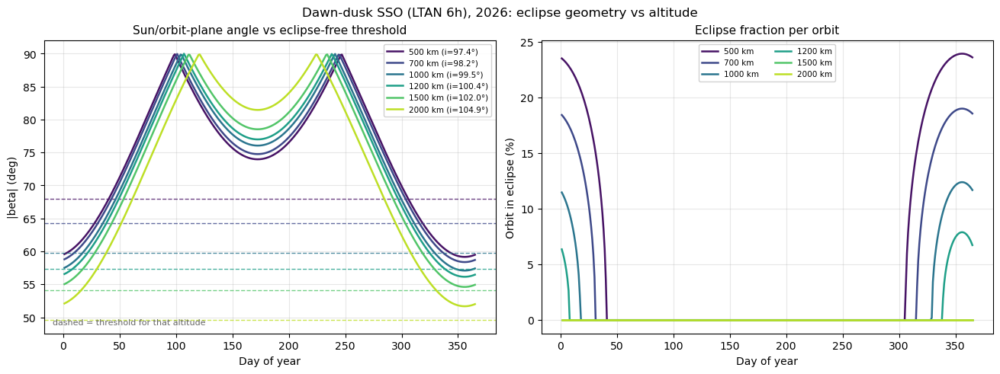
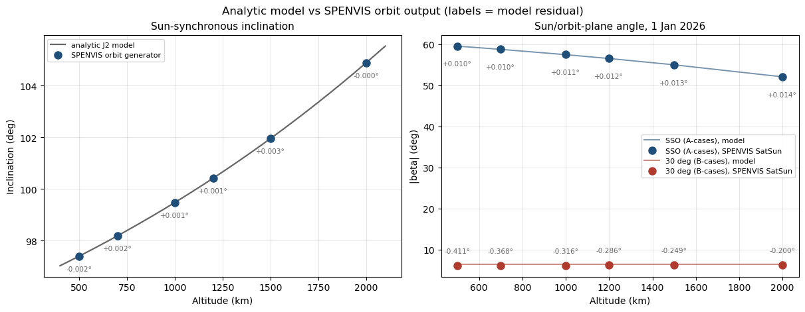

# Eclipse Geometry vs Altitude for Dawn–Dusk Sun-Synchronous Orbits

**Status:** Phase 1 supporting analysis
**Figure:** [`figures/beta_eclipse_sweep.png`](../figures/beta_eclipse_sweep.png)
**Code:** [`plots.py`](../SPENVIS/SPENPY/plots.py)

---

## 1. Why this matters

The reference scenario proposes sun-synchronous shells for baseline compute on the
premise that they are **over 99% sunlit**, removing the need for large batteries and
allowing near-continuous operation of the compute payload. The filed altitude range
is 500–2,000 km.

That premise is altitude-dependent, and it does not hold across the whole filed range.
This note derives the condition, evaluates it over a full year for six altitudes, and
identifies where the premise breaks.

The result is not simply "higher is better." Sun-synchronicity ties inclination to
altitude, and the inclination penalty cancels roughly 40% of the geometric benefit of
climbing.

---

## 2. The orbit (Analytic Model)

### 2.1 Sun-synchronicity

A sun-synchronous orbit (SSO) exploits the Earth's oblateness. The J2 term of the
geopotential causes the right ascension of the ascending node, Ω, to precess at

$$\dot{\Omega} = -\frac{3}{2} J_2 \left(\frac{R_\oplus}{a}\right)^2 n \cos i$$

where `a` is semi-major axis, `n = sqrt(mu/a^3)` the mean motion, and `i` the
inclination. Choosing `i` such that this rate equals the mean rate of the Sun's
apparent motion along the ecliptic — 360° per 365.2422 days, or 1.99106 × 10⁻⁷ rad/s —
makes the orbit plane rotate with the Earth's motion about the Sun. The local solar time
at the ascending node (LTAN) is then approximately constant year-round. Physical constants: mu = 398600.4418 $\frac{km^3}{s^2}$, $R_{earth}$ = 6378.137 km, J2 = 1.08262668e-3.

Because `cos i` must be negative, every SSO is **retrograde**: `i > 90°`.

### 2.2 Inclination is a function of altitude

Solving the above for `i` at circular orbits gives:

| Altitude (km) | SSO inclination |
|---:|---:|
| 500 | 97.40° |
| 700 | 98.19° |
| 1,000 | 99.48° |
| 1,200 | 100.42° |
| 1,500 | 101.96° |
| 2,000 | 104.89° |

The 500 km value reproduces the 97.4° used in the SPENVIS orbit generator, confirming
the model. **Inclination rises with altitude**, and Section 5 shows this is what makes
the altitude trade non-obvious.

### 2.3 Dawn–dusk (LTAN 6h)

All A-cases use LTAN = 6h, placing the ascending node at the dawn terminator and the
descending node at dusk. The orbit plane is then close to perpendicular to the
Earth–Sun line, which:

- maximises the sun/orbit-plane angle, minimising or eliminating eclipse;
- keeps the solar array at a near-constant sun angle, avoiding a steering mechanism;
- puts one face of the spacecraft permanently anti-sunward, which is favourable for
  radiator placement — relevant given that thermal rejection, not power, is expected to
  be the binding constraint on orbital compute.

This is the standard configuration for power-limited missions and is what makes the
">99% sunlit" claim plausible in the first place. The question is at what altitude it
becomes true.

---

## 3. The beta angle

Define **β** as the angle between the Sun direction and the orbit plane. β = 90° places
the Sun normal to the orbit plane (deepest sunlight); β = 0° places the Sun in the orbit
plane, so the satellite passes directly behind the Earth every revolution.

$$\sin\beta = \cos\delta_\odot \sin i \sin(\Omega - \alpha_\odot) + \sin\delta_\odot \cos i$$

with `delta_sun` the solar declination and `alpha_sun` the solar right ascension.

For an SSO with frozen LTAN, the node stays at a fixed angle from the Sun:

$$\Omega - \alpha_\odot = (\mathrm{LTAN} - 12)\times 15°$$

For LTAN = 6h this is −90°, and the expression collapses to

$$\beta = -\arcsin\left[\sin(i - \delta_\odot)\right]$$

so β depends only on inclination and solar declination. Since `delta_sun` sweeps
±23.44° over the year, **β sweeps by roughly ±23° about a mean set by inclination.**

### 3.1 Annual behaviour

|β| reaches 90° twice a year, when `delta_sun = i - 90°`. Between those peaks lies a
shallow June-solstice minimum; at either end of the year lies the **global minimum at
the December solstice**. Eclipse risk is therefore a winter phenomenon, concentrated in
a single season rather than distributed through the year.

---

## 4. The eclipse condition

Using a cylindrical umbra of radius `R_earth`, a circular orbit avoids the shadow entirely when

$$|\beta| > \beta_{\mathrm{crit}} = \arcsin\!\left(\frac{R_\oplus}{R_\oplus + h}\right)$$

When `|beta| < beta_crit`, the fraction of each revolution spent in shadow is

$$f = \frac{1}{\pi}\arccos\!\left[\frac{\sqrt{h^2 + 2R_\oplus h}}{(R_\oplus + h)\cos\beta}\right]$$

`beta_crit` falls monotonically with altitude — the Earth subtends a smaller angle from
higher up — which is the intuitive reason altitude helps.

---

## 5. The competing trends

Two altitude dependencies act in opposition:

| | 500 km | 2,000 km | Change |
|---|---:|---:|---:|
| `beta_crit` (threshold to clear) | 68.02° | 49.58° | **−18.44°** |
| `beta_min` (annual minimum, Dec solstice) | 59.16° | 51.67° | **−7.49°** |
| Margin (`beta_min − beta_crit`) | −8.86° | +2.10° | +10.96° |

Climbing lowers the threshold by 18.44°, but the accompanying inclination increase
(97.40° → 104.89°) tilts the orbit plane further from the Sun and drops `beta_min` by
7.49°. **Altitude wins only because the threshold falls about 2.5× faster than β does.**

The magnitude of the penalty is worth stating directly. Holding inclination artificially
fixed at 97.40°, `beta_min` would remain 59.16° at all altitudes and the eclipse-free
threshold would fall at **≈1,050 km**. The actual threshold, with sun-synchronicity
enforced, lies between 1,200 and 1,500 km. The inclination penalty therefore costs
roughly 350–450 km of altitude.

This appears not to be commonly foregrounded in constellation-planning discussions,
where SSO inclination is often treated as a fixed ~98° rather than as a function of the
altitude being traded.

---

## 6. Results

Evaluated daily through 2026 at LTAN 6h:

| Alt (km) | i | β_min | β_crit | Margin | Eclipse days/yr | Max eclipse | Max duration | Eclipsed orbits/yr | Annual sunlit |
|---:|---:|---:|---:|---:|---:|---:|---:|---:|---:|
| 500 | 97.40° | 59.16° | 68.02° | −8.86° | 100 | 23.9% | 22.7 min | ~1,520 | **94.7%** |
| 700 | 98.19° | 58.38° | 64.30° | −5.93° | 80 | 19.0% | 18.8 min | ~1,170 | **96.7%** |
| 1,000 | 99.48° | 57.09° | 59.82° | −2.74° | 54 | 12.4% | 13.0 min | ~740 | **98.6%** |
| 1,200 | 100.42° | 56.15° | 57.31° | −1.17° | 34 | 7.9% | 8.6 min | ~450 | **99.4%** |
| 1,500 | 101.96° | 54.61° | 54.06° | **+0.55°** | 0 | 0 | — | 0 | **100%** |
| 2,000 | 104.89° | 51.67° | 49.58° | **+2.10°** | 0 | 0 | — | 0 | **100%** |

### Reading the figure

**Left panel — the geometry.** Each solid curve is |β| through the year for one
altitude; each dashed line is that altitude's `beta_crit`. Compare a solid curve
**only to the dashed line of the same colour** — the threshold is altitude-specific,
and comparing across colours is meaningless. Where a curve dips below its own dashed
line, that altitude is in eclipse season.

Note that the 2,000 km curve sits *below* the 500 km curve at the December ends
despite being the better orbit: that is the inclination penalty made visible. Higher
inclination also widens the annual swing, giving the 2,000 km case both the highest
summer minimum (81.5°) and the lowest winter minimum (51.7°).

**Right panel — the consequence.** Eclipse fraction per revolution, obtained by
feeding the left panel's β into the shadow-fraction expression of Section 4. Each
curve is non-zero exactly where the corresponding solid curve in the left panel lies
below its dashed line.

Three features carry the argument:

- **The flat zero from roughly day 45 to day 300.** Every altitude, including 500 km,
  is fully sunlit for most of the year. Eclipse is a seasonal condition, not a
  permanent one.
- **The 1,500 km and 2,000 km curves are identically zero.** They never appear on
  this panel at all.
- **The curves terminate abruptly rather than tapering.** Eclipse onset is sharp:
  once β crosses `beta_crit` the shadow fraction rises steeply from zero, because the
  arccos in the shadow-fraction expression has infinite slope at its argument's upper
  limit. There is no gentle transition into eclipse season — a shell either clears the
  shadow or enters it over a few days.

The vertical axis is fraction of *each revolution*, not of the day. Multiplying by the
orbital period gives the durations in the table above, and by the revolutions per day
gives the annual counts.

[](../figures/beta_eclipse_sweep.png)

---

## 7. Validation against SPENVIS

The analytic model shares no code or data with the SPENVIS orbit generator, so the
two constitute an independent check. Two quantities are compared across all twelve
orbit cases.

**Inclination.** For heliosynchronous cases SPENVIS derives inclination from altitude
and LTAN internally. Agreement with the J2 model of Section 2.2 is within
**−0.002° to +0.003°** at every altitude, confirming the inclination–altitude
relationship on which Section 5 depends.

**Beta angle.** The `spenvis_att.txt` output carries the Sun direction in the orbit
frame; its second component is constant to 2 × 10⁻⁴ over 1,441 trajectory points,
identifying it as the orbit-normal projection, i.e. sin β.

| Case set | β residual (model − SPENVIS) |
|---|---|
| A (SSO, LTAN 6h) | +0.010° to +0.014° |
| B (30°, RAAN 0) | −0.411° to −0.200° |

The order-of-magnitude difference is expected and diagnostic. The model assumes
Ω − α_sun is constant, which is exactly the sun-synchronous condition — nodal
regression cancelling the Sun's apparent motion. For the A-cases the assumption
holds by construction and residuals reflect only the ~0.2° solar ephemeris series.

For the B-cases it does not hold. At 30° inclination the node regresses 6.6°/day at
500 km, falling to 3.3°/day at 2,000 km, which SPENVIS propagates but the model
neglects. A first-order estimate using the mean nodal shift over the one-day arc
predicts −0.30° to −0.15°; observed residuals are −0.41° to −0.20°, matching in sign,
magnitude, and altitude trend — both fall by a factor of 2.0 across the range.

The model is therefore validated for the sun-synchronous cases to ~0.01°, which is
the regime the eclipse conclusions concern. Its known limitation for non-sun-
synchronous orbits is quantified rather than assumed.



---

## 8. Limitations

1. **Cylindrical umbra.** A conical shadow with penumbra would shift boundaries by a few
   tenths of a degree, in the direction of *more* eclipse. Atmospheric refraction and
   extinction near the terminator are also neglected.
2. **Declination precision ~0.2°.** A low-precision solar series is used. This matters
   only where margins are small.
3. **The 1,500 km case clears its threshold by 0.55°**, which is comparable to the
   combined uncertainty from (1) and (2). It should be treated as *marginally*
   eclipse-free pending a higher-precision ephemeris and a conical shadow model. The
   2,000 km case, at +2.10°, is robust.
4. **Frozen LTAN.** J2 precession matches the Sun's *mean* rate; the true rate varies
   with obliquity and orbital eccentricity, so LTAN drifts by tens of minutes over a
   year. Higher-order geopotential terms and luni-solar perturbations add further drift.
5. **Epoch-specific.** Evaluated for 2026. Results shift slightly with year.
6. **Circular orbits assumed** throughout, consistent with the case matrix.

---

## 9. Implications

**The ">99% sunlit" premise holds only above roughly 1,200 km.** At 500 km the orbit
eclipses on 100 days a year, up to 23.9% of each revolution — some 1,520 eclipsed
revolutions annually. At 1,200 km it reaches 99.4%, and at 1,500 km and above it is
continuous.

**Battery sizing is a winter-season problem, not a continuous one.** Because eclipse is
concentrated at the December solstice, a low-altitude shell needs storage sized for the
worst-case 22.7-minute pass, but exercises it only about 1,520 times a year rather than
every revolution. For an illustrative 50 kW compute payload that is ≈19 kWh of usable
storage — of order 100 kg at 200 Wh/kg, before accounting for depth-of-discharge margin,
array oversizing to recharge, and cycle-life degradation.

**Above ~1,500 km that mass disappears entirely**, which is the real argument for the
upper half of the filed range. It has nothing to do with radiation, and it is not
visible in a dose-versus-altitude analysis.

**But the benefit saturates well before 2,000 km.** The step from 1,200 to 1,500 km buys
the last 0.6 percentage points of sunlight and eliminates the battery. The step from
1,500 to 2,000 km buys nothing further — both are continuously sunlit — while
substantially increasing total ionising dose, deorbit ΔV, and launch mass penalty.

Taken with the dose results, this bounds the defensible band to approximately
**1,200–1,500 km**, narrower than the filed 500–2,000 km range.

---

## 10. Reproduction

```python
from plots import plot_beta_sweep
summary = plot_beta_sweep(alts=[500, 700, 1000, 1200, 1500, 2000],
                          ltan_hr=6.0, year=2026)
print(summary.to_string(index=False))
```

Physical constants: `mu = 398600.4418 km^3/s^2`, `R_earth = 6378.137 km`,
`J2 = 1.08262668e-3`. No SPENVIS output is required — the analysis is analytic, and
SPENVIS is used only for the independent check in Section 7.
