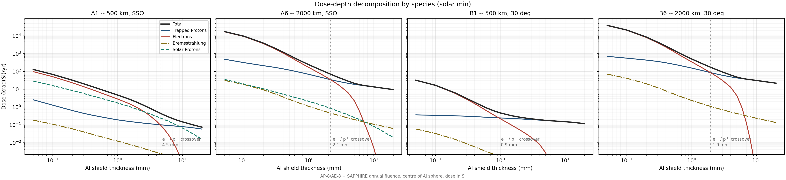
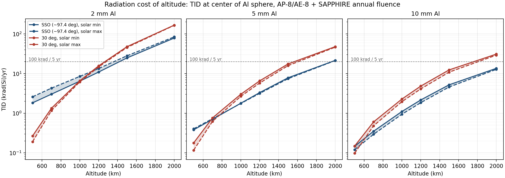

# Radiation Environment vs Altitude

**Status:** Phase 1 primary result
**Figures:** [`figures/tid_vs_altitude.png`](../figures/tid_vs_altitude.png) ·
[`figures/dose_decomposition_solarmin.png`](../figures/dose_decomposition_solarmin.png)
**Code:** ['plot_dose_decomposition()'](../SPENVIS/SPENPY/plots.py), ['plot_tid_vs_altitude()'](../SPENVIS/SPENPY/plots.py)

---

## 1. The design question

The reference scenario proposes compute shells anywhere from 500 to 2,000 km, at
sun-synchronous and ~30° inclinations, on a replacement cadence of roughly five years.

This note answers: **what does each altitude in that range cost in total ionising dose,
and does any part of it make commerical off the shelf (COTS) accelerator hardware untenable within the replacement
interval?**

The short answer is that the top of the filed range does, and that the inclination
trade reverses direction below 700 km.

---

## 2. Environment and configuration

Twelve orbit cases: six altitudes (500, 700, 1,000, 1,200, 1,500, 2,000 km) at two
inclinations. A-cases are dawn–dusk sun-synchronous (LTAN 6h); B-cases are circular at
30°. All circular, 365-day mission, epoch 1 Jan 2026.

| Component | Model |
|---|---|
| Trapped protons | AP-8, MIN and MAX |
| Trapped electrons | AE-8, MIN and MAX |
| Solar protons | SAPPHIRE total fluence, 95% confidence |
| Magnetospheric shielding | Størmer, eccentric dipole, stormy, CREME96 moment, all arrival directions |
| Dose | SHIELDOSE-2, centre of aluminium sphere, silicon target |

Doses below are **rad(Si) per year at the centre of a solid aluminium sphere**. This is
a screening geometry, not a spacecraft. A representative flat-panel bus with a Geant4
transport cross-check is Phase 2 work; the sphere results establish the trade and will
be validated against it.

Three SHIELDOSE runs per case: AP-8/AE-8 MIN with annual solar fluence, MAX with annual
solar fluence, and MAX with a worst-event solar fluence. **The third has no meaningful
total** — it sums a 365-day trapped dose with a single-event solar dose.

---

## 3. Dose-depth structure



Four cases at the corners of the matrix — 500 and 2,000 km, at both inclinations — show
how the species mix shifts with altitude and inclination. All four use AP-8/AE-8 solar
minimum with annual SAPPHIRE fluence.

**Trapped electrons** (red) dominate thin shielding in every case and then fall off a
cliff. AE-8 electrons top out near 7 MeV, so past roughly 8 mm Al they are fully stopped
and contribute nothing — visible as the near-vertical drop at the right of each panel.
The magnitude varies enormously: at 2 mm the electron dose runs from 51.8 rad/yr at B1
to 81,471 rad/yr at B6, a factor of 1,573.

**Trapped protons** (blue) decline gently and set the floor at depth. The AP-8 spectrum
extends to 400 MeV and its high-energy tail is essentially unshieldable at practical
mass. B1 is the clearest illustration: its proton curve is nearly flat across the whole
range, falling only from 0.37 to about 0.13 krad(Si)/yr over 400× in shield thickness.
Adding aluminium to a proton-dominated orbit buys very little.

**Solar protons** (green dashed) behave completely differently between the two
inclinations, and this is the most visible contrast in the figure.

At A1 the solar curve sits *above* the trapped proton curve across most depths — solar
protons are the largest single contributor to A1's dose at 5 mm. At A6 the same curve
has dropped to the bottom of the panel, running alongside bremsstrahlung. Nothing
happened to the solar environment: its dose grows only 1.23× across the filed range
(Section 5.2), while trapped protons grow 193×. The solar contribution is simply
overwhelmed.

**In both B panels the solar proton curve is absent entirely.** At 30° inclination the
orbit reaches invariant latitudes of roughly 41°, giving a Størmer cutoff rigidity of
order 2–3 GV. SAPPHIRE models solar protons only to 1 GeV, so the entire spectrum sits
below cutoff and the magnetospheric attenuation factor is identically zero at every
energy — confirmed directly in the SAPPHIRE output. The 30° shells are effectively
immune to solar particle events. That this is rigidity discrimination rather than a
model failure is confirmed by Galactic Cosmic Ray (GCR), which extends to TeV energies and *is* transmitted
to the B-cases at 21–43% of the SSO flux.

**Bremsstrahlung** (olive) never exceeds 1.01% of total dose anywhere in the matrix. Its
share peaks at intermediate depth — where primary electrons have been stopped but the
proton continuum has not yet taken over — then declines. It is most prominent in B6,
where the electron flux that generates it is largest, and nearly invisible in B1, which
has almost no electrons to convert.

### The electron/proton crossover moves

The depth at which trapped protons overtake electrons is annotated on each panel:

| Case | Altitude | Inclination | Crossover |
|---|---:|---|---:|
| A1 | 500 km | SSO | 4.5 mm |
| A6 | 2,000 km | SSO | 2.1 mm |
| B1 | 500 km | 30° | 0.9 mm |
| B6 | 2,000 km | 30° | 1.9 mm |

It is not a fixed property of the environment, and it does not move in the same
direction for both inclinations.

For the **SSO shells the crossover moves shallower** with altitude, 4.5 → 2.1 mm,
because trapped protons grow faster than electrons (268× vs 43× at 2 mm). A polar orbit
already samples the outer electron belt at 500 km, so its electron dose has less room to
grow, while its proton dose climbs steeply into the inner belt.

For the **30° shells it moves deeper**, 0.9 → 1.9 mm, because the ordering reverses:
electrons grow 1,573× against 390× for protons. A 30° orbit at 500 km barely reaches the
electron belts at all, so its electron dose starts from a very low base and rises
sharply as the orbit climbs toward the slot region.

The consequence for shielding: **below the crossover the shield is working against
electrons, above it against protons**, and the transition sits at a different depth for
every orbit. B1 is proton-limited from under a millimetre of aluminium onward; A1 is
electron-limited out to 4.5 mm. A single shield thickness applied across the
constellation would be solving different problems in different shells.

Since every case is proton-dominated beyond a few millimetres, the productive direction
is **lower** Z, not higher: hydrogen-rich materials such as polyethylene (Z/A ≈ 0.57)
offer roughly 20% better proton mass stopping power than aluminium and moderate
secondary neutrons efficiently. A polyethylene-loaded structural panel is the variant
worth evaluating in Phase 2, not graded-Z.

Note that SHIELDOSE-2 is a pre-computed aluminium-only model

---

## 4. The solar-cycle envelope inverts

AP-8 and AE-8 respond to the solar cycle in opposite directions:

- **AE-8 MAX > AE-8 MIN.** Outer-belt electron fluxes rise at solar maximum.
- **AP-8 MIN > AP-8 MAX.** At solar maximum the heated, expanded atmosphere depletes the
  inner proton belt.

Since thin shielding is electron-dominated and thick shielding proton-dominated, the
worse of the two cases depends on shield depth — and, because the electron-to-proton mix
also shifts with altitude, on altitude as well:

| Shield depth | 500 km | 700 km | 1,000 km | 1,200 km | 1,500 km | 2,000 km |
|---|---|---|---|---|---|---|
| 2 mm | MAX | MAX | MAX | MAX | MAX | MAX |
| 5 mm | MAX | MAX | **MIN** | MIN | MIN | MIN |
| 10 mm | MIN | MIN | MIN | MIN | MIN | MIN |

**The MIN/MAX pair is an envelope, not a bound.** Neither case is uniformly conservative,
and labelling either as "worst case" is wrong. In the figure below the two curves are
plotted individually with faint shading between them for this reason.

---

## 5. TID vs altitude



Annual dose behind 5 mm Al, solar-minimum trapped models (krad(Si)/yr):

| Altitude | SSO | 30° | ratio A/B |
|---:|---:|---:|---:|
| 500 km | 0.38 | 0.18 | 2.14 |
| 700 km | 0.70 | 0.76 | 0.92 |
| 1,000 km | 1.79 | 3.02 | 0.59 |
| 1,200 km | 3.31 | 6.57 | 0.50 |
| 1,500 km | 7.82 | 17.49 | 0.45 |
| 2,000 km | 21.51 | 47.81 | 0.45 |

Dose rises by **56× for the SSO shells and 269× for the 30° shells** across the filed
range. There is no sharp knee at the inner-belt onset; the rise is close to log-linear in
altitude, roughly a factor of two per 300 km above 1,000 km.

### 5.1 The inclination trade reverses at ~600 km

The SSO shells are worse than the 30° shells only at 500 km. By 700 km the ordering has
flipped, and above 1,000 km the 30° shells take roughly twice the dose.

The decomposition explains why. **On trapped protons alone, the 30° orbit is worse at
every altitude** — 175 vs 97 rad/yr even at 500 km — because a 30° orbit passes through
the South Atlantic Anomaly on most revolutions while a polar orbit only clips its edge.
The SSO total is higher at 500 km *solely* because of a solar proton contribution the
30° shells do not have at all.

A secondary observation: 30°-case electron dose is nearly identical between AE-8 MIN and
MAX (51.9 vs 51.8 rad/yr at 500 km, 2 mm), while the SSO cases differ by roughly 2×.
AE-8's solar-cycle dependence lives in the outer belt, which only the polar orbit
samples. This is a property of how AE-8 was built — its MIN and MAX maps are nearly
identical in the inner zone — rather than evidence that the real inner-belt environment
is solar-cycle invariant.

### 5.2 Solar protons are almost altitude-independent

At 5 mm Al, SSO, solar-minimum trapped models — annual dose in rad(Si)/yr:

| | 500 km | 2,000 km | growth |
|---|---:|---:|---:|
| Solar protons | 211.6 | 260.4 | **1.23×** |
| Trapped electrons | 69.3 | 2,249.7 | 32× |
| Trapped protons | 97.4 | 18,802 | 193× |

Solar proton dose varies by only 23% across the entire filed range, because geomagnetic
cutoff at high latitude is already low and weakens only slightly with altitude. Its
*share* of the total therefore collapses from 55.6% at 500 km to 1.2% at 2,000 km.

**The 30° shells receive exactly zero solar proton dose at every altitude.** At 30°
inclination the orbit never reaches invariant latitudes where cutoff rigidity falls low
enough for solar protons to arrive. This is a genuine trade: the low-inclination shells
buy immunity to solar particle events at the cost of continuous South Atlantic Anomaly (SAA) exposure. Any
requirement for the compute payload to power-safe during a Solar Particle Event (SPE) applies to the
sun-synchronous shells only.

### 5.3 Shielding effectiveness falls with altitude

Dose reduction going from 2 mm to 10 mm Al (+21.6 kg/m²), solar-minimum:

| | 500 km | 1,000 km | 1,500 km | 2,000 km |
|---|---:|---:|---:|---:|
| SSO | 12.5× | 5.8× | 4.8× | 5.8× |
| 30° | 1.8× | 2.9× | 3.9× | 5.4× |

The SSO trend falls because the environment hardens with altitude: the electron component
that thick shielding removes efficiently gives way to a proton spectrum that does not.
The 30° trend rises from a very low base because those shells are proton-dominated from
500 km upward, where an extra 8 mm of aluminium buys almost nothing.

The engineering consequence: **shield mass is a poor lever at high altitude.** Going from
5 mm to 10 mm at 2,000 km SSO reduces annual dose by only 36%.

> \* All doses in this note are computed at the **centre of a solid aluminium sphere**
> (SHIELDOSE-2, silicon target). A 4π sphere is a screening geometry, not a spacecraft:
> real hardware sits behind a highly anisotropic mass distribution, with some directions
> shielded by the bus and others nearly open. The sphere is conservative for a
> well-buried component and optimistic for one near an exposed panel. Absolute doses
> should therefore be read as scaling results rather than predictions, though the
> *relative* comparisons across altitude and inclination — which are what this trade
> depends on — are far less sensitive to geometry than the absolute values. A
> representative flat-panel bus model with a Geant4 transport cross-check is Phase 2
> work (Section 8).

---

## 6. Lifetime map

Assuming a **100 krad(Si) COTS tolerance** and a **five-year replacement cadence** — both
analyst assumptions, flagged as such — the accumulated dose is:

Five-year TID (krad(Si)), worse of MIN/MAX; **bold** exceeds the budget:

| Altitude | SSO 2 mm | SSO 5 mm | SSO 10 mm | 30° 2 mm | 30° 5 mm | 30° 10 mm |
|---:|---:|---:|---:|---:|---:|---:|
| 500 km | 13.0 | 2.0 | 0.7 | 1.3 | 0.9 | 0.7 |
| 700 km | 21.4 | 3.6 | 1.8 | 6.7 | 3.8 | 3.0 |
| 1,000 km | 42.4 | 8.9 | 5.5 | 32.8 | 15.1 | 11.4 |
| 1,200 km | 67.1 | 16.6 | 10.8 | 78.3 | 32.8 | 24.2 |
| 1,500 km | **140.4** | 39.1 | 26.0 | **238.6** | 87.5 | 61.9 |
| 2,000 km | **420.6** | **107.5** | 67.7 | **832.9** | **239.1** | **154.7** |

Reading the map:

- **Below 1,200 km, TID is not the limiting factor at any of these depths.** Obsolescence
  or the replacement cadence ends the satellite first, which is the assumption the
  reference scenario rests on.
- **At 1,500 km, 2 mm is insufficient** for both inclinations; 5 mm is comfortable.
- **At 2,000 km the SSO shells need more than 5 mm** (107.5 krad, marginally over), and
  the 30° shells fail even at 10 mm (154.7 krad).
- The 30° shells are more constrained than the SSO shells everywhere above 700 km,
  despite having no solar proton exposure at all.

---

## 7. Displacement damage

NIEL-weighted displacement damage dose was computed for all twelve cases on
SHIELDOSE-2's default depth grid and is retained in the environment tables as
`niel_dose_MeV_per_g`, `niel_damage_equiv_fluence` (10 MeV proton equivalent), and
`niel_relative_damage` (the first scaled by a 1×10⁻¹¹ g/MeV damage factor).

**No DDD result is presented in Phase 1.** Two limitations put a meaningful analysis out
of reach with the current runs:

- *Proton-only.* SPENVIS's standalone NIEL module with a hydrogen damage factor yields
  trapped and solar proton contributions only. Electrons cause significant displacement
  damage in solar cells, and array coverglass is thin enough (~100 µm) that the electron
  environment dominates there — precisely the regime DDD is wanted for.
- *Solar-minimum only.* NIEL ran at step 7, between the trapped-MIN and trapped-MAX
  passes, so the results carry the AP-8 MIN environment throughout and have no
  solar-cycle band.

The altitude and inclination structure duplicates the TID result, since both are driven
by the same trapped proton environment, so a DDD-versus-altitude figure would add
nothing over Section 5.

Array end-of-life power is deferred to Phase 2, where MC-SCREAM and EQFLUX — which model
electron damage and cell-specific degradation directly — are the appropriate tools. The
NIEL tables are retained as an input to that work.

---

## 8. Limitations

1. **Geometry.** Centre of a solid aluminium sphere, not a spacecraft. A flat-panel bus
   with realistic mass distribution will differ, in general favourably for the shielded
   bay and unfavourably for exposed electronics. Slab and box geometries plus a Geant4
   cross-check are Phase 2.
2. **AP-8/AE-8 are legacy models**, epoch-limited and known to be conservative for
   electrons and to misplace SAA drift. IRENE/AE9-AP9 comparison runs are planned; they
   also provide percentile bands rather than a single MIN/MAX pair.
3. **AE-8 at 50% confidence.** A design study would normally use a higher percentile.
   This setting is recorded only in the configuration notes — it appears nowhere in the
   SPENVIS output files.
4. **The 100 krad tolerance is assumed**, not sourced from a device datasheet. Real COTS
   accelerator tolerance varies by orders of magnitude and is rarely published. The
   lifetime map should be read as a scaling result, not a qualification.
5. **No SEE analysis.** Total dose says nothing about single-event upset rates, which for
   a compute payload may bind well before TID does. >30 MeV integral proton flux is
   tabulated as the precursor metric; device cross-sections are Phase 2.
6. **Dose is orbit-averaged.** Instantaneous rates in the SAA are far higher than the
   annual average implies, which matters for latch-up and for operational duty cycling.

---

## 9. Conclusions

**Radiation alone does not exclude any part of the filed range**, provided shield depth
scales with altitude. The 2,000 km SSO shell needs roughly 10 mm of aluminium to stay
inside a 100 krad five-year budget where 500 km needs under 2 mm.

**The 2,000 km ceiling is the expensive end of the trade.** Relative to 1,500 km SSO it
costs 2.75× the annual dose at 5 mm, and shield mass is a weak lever there — the extra
5 mm from 5 to 10 mm buys only a 36% reduction.

**The inclination trade is not monotonic.** Below ~600 km the 30° shells are cleaner;
above it they are roughly twice as dirty, and they are the more TID-constrained of the
two across most of the range.

Read together with the [eclipse geometry note](docs/eclipse_geometry.md), which finds
that the >99%-sunlit premise fails below ~1,200 km **for dawn–dusk sun-synchronous
orbits**, the two constraints bound the useful band from opposite directions and leave
roughly **1,200–1,500 km** as the region satisfying both — narrower than the filed
500–2,000 km range. This applies to the SSO shells only; the 30° shells are not
eclipse-constrained in the same way, since their sunlit fraction is set by RAAN drift
rather than a frozen beta angle, and they were not analysed for eclipse in Phase 1.

Note also that the eclipse conclusion is specific to LTAN 6h. A different local time of
ascending node shifts the beta angle and moves the threshold; the dawn–dusk choice is
what makes the >99% claim achievable at any altitude in the filed range.

---

## 10. Reproduction

```python
from plots import load_long, dose_table, plot_tid_vs_altitude, plot_dose_decomposition

dose = dose_table(load_long("environment/odrs_long.parquet"))
plot_tid_vs_altitude(dose)
plot_dose_decomposition(dose, cases=["A1", "A6", "B1", "B6"], cycle="min")
```

Underlying tables: `environment/ionizing_dose.csv`, `environment/niel_*.csv`.
Per-case SPENVIS settings and run identifiers: `environment/settings/`.

Radiation environment data generated using SPENVIS (www.spenvis.oma.be), an ESA operational software system maintained by the Royal Belgian Institute for Space Aeronomy (BIRA-IASB).
